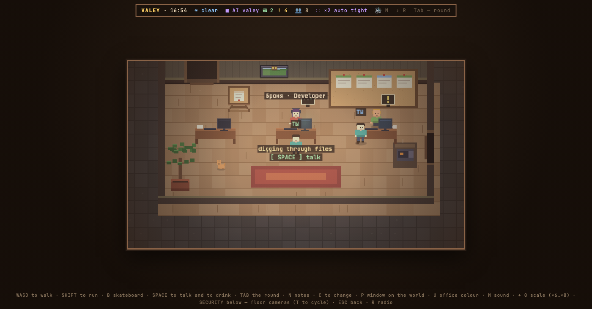

# Valey

A pixel-art office for the agents you already run.

Your Claude Code sessions become people in rooms — one room per project, one person per session. They type, get up for coffee, pin finished work on the board, and get a “!” over their heads when they are waiting on you. Instead of a list of chats that all look the same, you glance at a floor and see who needs you.



## Get it

```bash
curl -fsSL https://valey.dev/install.sh | sh
```

One command puts the office into `~/valey` and tells you how to start it; add `--run` after `sh -s --` to have it started for you. The script is [in this repository](install.sh), short enough to read first, and it refuses an archive whose checksum does not match the one published beside it. Or clone the repository — there is nothing to build either way.

## Run it

```bash
npm start
```

Then open <http://localhost:5177>.

Run it twice and the second one says where the first is and exits: two offices on one port would be two offices, not one. If something that is not Valey holds 5177, the office takes the next free port and says so — with the reminder that Claude Code sends its questions to 5177, so a hook set up later needs the port freed or `network.port` in the settings changed.

The server binds `127.0.0.1`, so the office answers this machine and nothing
else. 

### Reaching it from another device

Off by default, and it turns on together with a token — an open port without
one is exactly the hole described above, so the two cannot be set apart.

```bash
VALEY_EXTERNAL=1 npm start
#   exposed on 0.0.0.0 — from another device, once with a token:
#   http://<this-machine-address>:5177/?token=…
```

* **Loopback is always its own.** The browser on this machine knows nothing
  about tokens, or `npm start` would stop being enough.
* **The token in the address lives one request.** It arrives as `?token=`,
  moves into an `HttpOnly; SameSite=Lax` cookie and is dropped from the URL by
  a redirect: a secret in the address bar stays in browser history, in logs and
  in the `Referer` header. No `Secure` flag on purpose — over http (a tunnel, a
  LAN) the cookie would not be stored and the phone would quietly stop working.
* **Closed answers 404, not 403.** A scanner learns nothing about what is here.
* The token is never sent to the page — settings ride the SSE stream into a
  browser that also runs a radio iframe and a sandbox for foreign HTML. Only
  `hasToken` goes out.

**There is no install step.** Not a missing instruction — the project has no dependencies, so there is no `npm install` to run and no `node_modules` to appear. The only foreign thing the office itself carries is the JetBrains Mono font in `web/fonts/`, shipped as files under the OFL, because the office works without internet.

Everything in here is the office. The public page used to sit next to it — `web/landing.html`, which reached out to Google Fonts and to a form — and it moved to the site's own repository on 5 September 2026, along with the holding page for the domain. The office reaches out to nothing, and that is the point of the section below; the exception that blurred it is gone.

### If you do not have Node

Node is the one thing you need. Check with:

```bash
node -v
```

It should print `v18` or higher. If it prints nothing, or a smaller number:

* **macOS** — `brew install node`, or the installer from [nodejs.org](https://nodejs.org).
* **Windows** — `winget install OpenJS.NodeJS.LTS`, or the same installer.
* **Linux** — your package manager's `nodejs` package, or [nvm](https://github.com/nvm-sh/nvm) if you would rather not touch the system one.

npm comes with Node, so there is nothing else to fetch. If `node -v` works and `npm start` still does not, run `node server/index.js` — the error it prints is the useful one.

## What it shows

* **Who is in** — from `~/.claude/sessions/*.json`: pid, working directory, session name. Alive is checked with `process.kill(pid, 0)`.
* **What they are doing** — the transcript is read incrementally: the last tool call, the last thing said, whether the turn ended and they are waiting on you, which files they touched, which git branch they are on.
* **Their role** — from the tools they reach for. Edits code, so: developer. Opens design files: designer. Searches the web: researcher, etc. 
* **Their face and name** — a deterministic hash of the session id, so the same session is the same person every time you look.
* **The floor** — rebuilt whenever the cast changes, but a project keeps its slot, so somebody else starting work never shuffles your rooms.

Finished work goes on the board in the room. `.md` renders, code is highlighted, images get a pixel loupe. You can leave notes on any line of a conversation, and put a task on someone's desk.

## Answering a permission prompt from the office

When Claude Code needs a yes — *Allow Claude to run …?* — it can ask you here instead of only in the terminal you are not looking at. A pager slides into the corner and beeps, `Enter` opens the request where you stand, `Esc` puts it off and leaves a counter in the top bar that `H` brings back. The card shows the command in full, the description the agent gave it, and the rule that "always allow" would write — the same rule the native button writes, into the same file.

It is off until you install the hook, because it edits how your terminal behaves. In `~/.claude/settings.json`:

```json
{
  "hooks": {
    "PermissionRequest": [
      { "hooks": [{ "type": "command", "command": "node /path/to/valey-core/tools/permit.mjs" }] }
    ]
  }
}
```

While the office holds a question, the terminal stays quiet — so the hook is built to get out of the way at the first sign of trouble. Office not running, nobody looking at it, nine minutes with no answer, the hook killed: every one of those hands the question straight back, and Claude Code asks you itself. `VALEY_URL` points it at an office on another port.

Guests never see any of this: a command is paths and branches from your machine.

## Nothing leaves your machine

The office reads `~/.claude` on your own machine and draws the floor from it. Transcripts, code and project names are never sent anywhere.

Two exceptions, both yours to switch on, both named out loud:

* **The weather** outside the corridor window is invented until you turn on the real one — then a pair of coordinates goes to open-meteo, and nothing else.
* **The radio** plays through your own Spotify app, with a client id you create yourself. It is a module; delete the folder and the radio is gone.

There are no accounts, no telemetry and no analytics. The server is the handful of files in `server/`, and you can read every one of them before you run it — that is the point of the licence below.

## Modules

The office is a core plus a `modules/` folder. A module is a directory with a `module.json`; the core knows exactly one thing about it — whether the folder is there. Nothing is hidden behind a check, because a build without a feature is a build that does not contain it.

`modules/radio` is the worked example: a thing in the corridor, a panel, its own settings section, its own server route, its own dictionary and its own test. Delete the folder, restart, and the office comes back without a radio — no gap, no placeholder, no message about it.

Writing your own is [documented here](docs/modules.md).

The repository is called `valey-core` because that is what it is. The office is open core: this core and the cosmetic modules are here under the AGPL, and some modules — the ones that are sold, and the ones that need servers we run — are not. You are not missing a folder; they were never in this repository, and nothing here checks for them or degrades without them.

## Keys

Arrow keys walk · `SHIFT` runs · `SPACE` is the action — talk, drink at the cooler, sit on a bench · `TAB` the standup — who is on what · `N` notes · `C` clothes · `P` window on the world · `U` office colour · `M` sound · `R` radio · `S` starts and stops the music wherever you are · `K` the office plan · `H` the pager you put off · `F9` a 1:1 frame · `+` `0` scale · `ESC` back. The security room is below the floor and has the cameras. Press `?` in the office for the whole keyboard, which is generated from the same list the office answers to and cannot drift from this one.

The office fills the window. The scale is a whole number of screen dots per game pixel and is counted from the width — it promises at least 400 pixels of world across, and everything else the window gives goes into showing more of the floor, so a tall or a vertical monitor shows more of it rather than black bars. `+` and `−` pick the step by hand between ×2 and ×8, `0` hands the count back to the window.

A gamepad works too, and the keyboard stays free for typing: the left stick or d-pad walks (the stick is analogue — a light tilt is a slow walk), `A` talks, `B` goes back, `X` takes the skateboard, `Y` opens the standup, the triggers run and the bumpers scale. Any controller the browser sees as a standard one will do — an Xbox pad paired over Bluetooth on macOS, say. The browser only notices it after the first button press, and Chrome only offers it on `localhost` or over https.

## Tests

```bash
for t in tools/test-*.mjs modules/*/test-*.mjs; do node "$t"; done
```

No framework: each file prints its checks and exits non-zero if one failed. They cover the parts that break quietly — markdown, syntax highlighting, notes, plural forms in two languages, session parsing, the floor plan, the module loader, and the keyboard in every panel.

Everything drawn is checked with eyes: `tools/shot.mjs` takes the picture from a terminal, walks the office with `--keys`, and looks inside the live page with `--eval`.

## Release notes

Every release carries one, in [notes/](notes/): what the feature is, which keys it answers to, what was deliberately left out — and frames of the office showing it.

The pictures are recipes rather than files. A note records where to stand and which keys to press, so the same walk can be replayed against a worktree of an older tag and photographed there: the before half of a pair is the office that actually shipped with that version, not a caption. The floor in them is invented — made-up people on made-up projects, from the fixtures the tests use — because a photograph of a real office is a photograph of real project and branch names.

A note is written in the branch that builds the feature, not assembled at release time out of the commit subjects; that is what keeps it from being a longer copy of the changelog. How to write one is [documented here](notes/README.md).

What changed between releases, one line per commit, is in [CHANGELOG.md](CHANGELOG.md).

## Licence

[AGPL-3.0](LICENSE). Use it, read it, change it, run it for yourself or your team. If you distribute a changed version, or run it as a service for other people, your changes are theirs to read too — the same deal you get here.

Contributions need a signed agreement; see [CONTRIBUTING.md](CONTRIBUTING.md) for what it says and why.

## Not affiliated with Anthropic

Claude Code is Anthropic's. This is an independent project that reads the session files Claude Code leaves on your disk, and nothing else. It is not endorsed by, and has no connection to, Anthropic.

Found something that leaves the machine, or runs what you did not ask for? Write to security@valey.dev rather than opening an issue — [SECURITY.md](SECURITY.md) says what counts and what to include.

Built by [Sergei Goriugin (xoyk)](https://github.com/xoyk).
