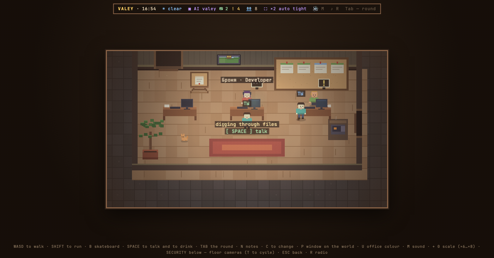

# Valey по-русски

Пиксельный офис для агентов, которые у тебя уже запущены.

Каждая сессия Claude Code становится человеком в комнате: комната на проект, человек на сессию. Они печатают, ходят за кофе и вешают готовую работу на доску. Вместо списка одинаковых чатов ты смотришь на этаж и видишь, кто ждёт тебя.



Это короткая инструкция для первого запуска. Полный текст, с устройством, приватностью и лицензией, в [README.md](README.md) по-английски.

## Что нужно

Node 18 или новее и Claude Code, который хотя бы раз запускался на этой машине: офис читает его сессии из `~/.claude`. Проверено на macOS. На Linux и Windows не проверялось, и если у тебя одна из них, скажи об этом отдельно.

```bash
node -v
```

Если печатает `v18` или больше, всё есть. Если ничего или меньше: на macOS `brew install node` или установщик с [nodejs.org](https://nodejs.org), на Windows `winget install OpenJS.NodeJS.LTS`, на Linux пакет `nodejs`. npm приходит вместе с Node, больше ничего ставить не надо.

## Установка

```bash
curl -fsSL https://valey.dev/install.sh | sh
```

Одна команда спросит, куда положить офис (Enter — в `~/valey`), скачает архив последней версии, сверит контрольную сумму и скажет, как запустить. Зависимостей у офиса нет, так что `npm install` не будет. Если хочешь сначала прочитать, что запускаешь, а так и стоит делать:

```bash
curl -fsSL https://valey.dev/install.sh -o install.sh && less install.sh && sh install.sh
```

Тот же скрипт лежит [в этом репозитории](install.sh). Второй способ — склонировать репозиторий: собирать нечего.

## Запуск

```bash
cd ~/valey && npm start
```

Потом открой [http://localhost:5177](http://localhost:5177). Чтобы одной командой и поставить, и запустить, добавь `--run`:

```bash
curl -fsSL https://valey.dev/install.sh | sh -s -- --run
```

Второй `npm start` рядом скажет, где уже работает первый, и выйдет. Если порт 5177 занят чем-то чужим, офис возьмёт следующий свободный и назовёт его.

## Первый экран

Ты в коридоре перед дверью. Слева меню: «Войти», «Кто внутри», «Одежда», «Окно в мир». Внизу поле «как тебя зовут», его можно пропустить и поменять потом клавишей C.

Язык офис берёт из браузера. Переключить: подойди к фигурке справа от двери и нажми ПРОБЕЛ, там же выбираются имена агентов.

Если на карточке «за дверью» написано «пока никого», это не поломка: офис населяют запущенные сессии Claude Code. Открой `claude` в любом проекте, и через пару секунд он въедет в офис своей комнатой. Войти можно и на пустой этаж.

## Что ты увидишь

Комнату на каждый проект, где идёт сессия, и человека на каждую сессию. Кто печатает, кто ждёт твоего ответа, кто ушёл за кофе. Готовая работа висит на доске в комнате: `.md` рендерится, код подсвечен, у картинок есть лупа. К любой строке разговора можно оставить заметку, а на стол — положить задание.

TAB открывает планёрку: все команды и кто чем занят на одном экране, с переходом к нужному человеку.

Имя, лицо и профессия у агента считаются из самой сессии: тот же самый человек при каждом взгляде, а профессия по инструментам, за которые он берётся.

## Клавиши

Стрелки — ходить · SHIFT — бежать · ПРОБЕЛ — действие: поговорить, попить у кулера, покормить пираний, сесть на скамейку · `+` у стойки ресепшена — нанять нового агента · TAB — планёрка · N — заметки · C — одежда и имя · P — окно в мир · U — цвет офиса · M — звук · R — радио · S — включить и выключить музыку · K — план офиса · G — газетный киоск · H — отложенный пейджер · F9 — кадр 1:1 · `+` `−` `0` — масштаб · ESC — назад.

Нажми `?` в офисе, и он покажет всю клавиатуру. Этот список собирается из того же места, на которое офис отвечает, так что он правдивее любой инструкции, включая эту.

Геймпад тоже работает: левый стик или крестовина ходят, A — поговорить, B — назад, X — скейт, Y — планёрка.

## Ответить агенту из офиса

Когда Claude Code спрашивает разрешение («Allow Claude to run …?») или задаёт вопрос с вариантами, офис может показать это у себя: в углу появляется пейджер и пищит, Enter открывает запрос, Esc откладывает. Ответ уходит агенту так, как будто ты нажал кнопку в терминале.

Это выключено, пока ты сам не поставишь хук, потому что он меняет поведение твоего терминала. В `~/.claude/settings.json`:

```json
{
  "hooks": {
    "PermissionRequest": [
      { "hooks": [{ "type": "command", "command": "node /path/to/valey-core/tools/permit.mjs" }] }
    ],
    "PreToolUse": [
      { "matcher": "AskUserQuestion", "hooks": [{ "type": "command", "command": "node /path/to/valey-core/tools/permit.mjs" }] }
    ]
  }
}
```

Путь замени на свой. Если офис не запущен, на него никто не смотрит или ответа нет девять минут, вопрос возвращается в терминал, и Claude Code спрашивает сам.

## Ничего не уходит с машины

Офис читает `~/.claude` на твоей машине и рисует по нему этаж. Транскрипты, код и названия проектов никуда не отправляются. Ни аккаунтов, ни телеметрии, ни аналитики.

Три исключения, и каждое включаешь ты сам: настоящая погода за окном (пара координат уходит в open-meteo), радио (Spotify через твоё приложение или интернет-станции) и газетный киоск (открытые каналы Telegram, если ты их добавил).

## Обновить

В инвентаре (C), во вкладке офиса, кнопка «update». Или `npm run update` в другом терминале: офис подтянет новую версию и переключится на неё, не останавливаясь, если был запущен через `npm start`. Сам он никогда ничего не проверяет. Офис, поставленный из архива, обновляется повторным запуском команды установки.

## Удалить

Удали папку офиса. Настройки лежат в `~/.config/valey/settings.json`, их можно удалить следом. Если ставил хук, убери его строки из `~/.claude/settings.json`.

## Платные модули

Бесплатный офис — это всё, что здесь лежит. Мольберт с макетами Figma, дерево гита, лента на телефон и другие рабочие модули продаются отдельно и ставятся поверх: `--pack=<архив>` у той же команды установки. Папок с ними в этом репозитории нет, и офис без них ничего не ищет и ни на что не жалуется.

## Если что-то не так

Если ты из первой когорты, пиши туда, где тебя позвали: каждая застрявшая установка чинится в продукте и в этой инструкции. Баги — в [Issues](https://github.com/valey-dev/valey-core/issues). Нашёл что-то, что уходит с машины или делает то, чего ты не просил, — пиши на security@valey.dev, а не в issue.

Claude Code принадлежит Anthropic. Valey — независимый проект, который читает файлы сессий с твоего диска, и больше ничего. Anthropic к нему отношения не имеет.
