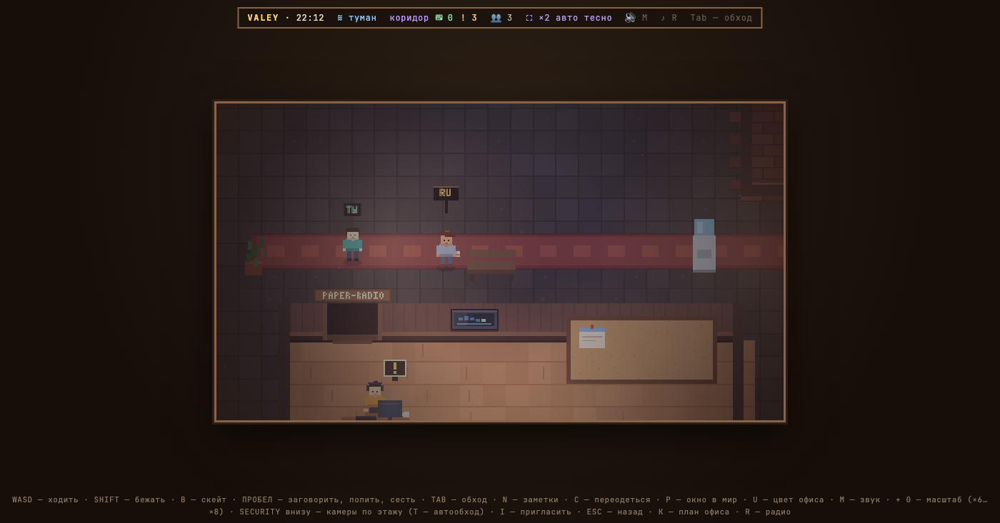

# v0.10.0 — 5 September 2026

## The whole keyboard on «?»

*office*

This note was written after the fact, out of the changelog and two replayed frames. The words are not those of whoever built the feature.

The keys used to live in two lines of small text along the bottom of the window, and that strip was written by hand: it listed what somebody remembered to list, and it drifted from what the office actually answered to.

Now `?` draws the keyboard itself. Every cap says what it does, the colours group them — movement, action, panels, scale, panel-only, service — and the free letters are marked free, so the panel doubles as the answer to «what can I still bind?». It is built from the registry the office answers to, so it cannot lie about a key. The strip below shrank to one line.

*Before, v0.9.0*

*After, v0.10.0*

**Keys**

- `?` — the keys
- `ESC` — close

### What changed

### Added

- **lounge:** a bear skin in front of the sofa, head and teeth included (a9a65bb)
- **keys:** walking moves to the arrows, and WASD gives back its four letters (659ee0a)
- **keys:** the keyboard fills the panel instead of sitting in a column (9bed03e)
- **keys:** the whole keyboard on «?», and the strip below shrinks to one line (c54e314)
- **keys:** the strip at the bottom is built from the registry, so it cannot lie about the keys (21e219a)

### Fixed

- **sprites:** a look built by hand keeps its hair (a95f128)
- **keys:** T is «смена камер» and I is «гости», in words that fit the cap (aa56c2c)
- **keys:** the space bar acts alone, and E goes back to the free letters (e786dd9)
- **keys:** the space bar says «действие», the pager says «пейджер» (a067382)
- **keys:** one word for clothes everywhere, and F9 says what fits on a cap (3b0329c)
- **keys:** the panel highlights a key the way the frame does — a bar along its bottom edge (1f745b5)

### Other

- refactor(keys): the office answers to actions, and reads the key under the finger, not the letter on it (0a21c38)
