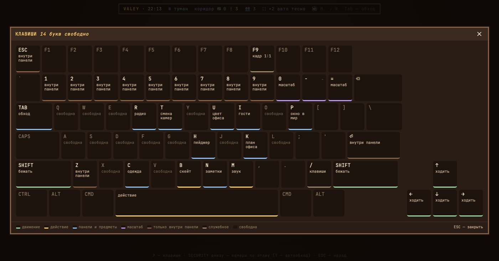
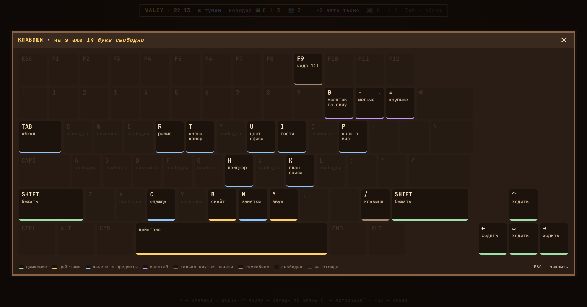

# v0.12.0 — 6 September 2026

## «?» shows the keys of the place you are standing in

*office*

This note was written after the fact, out of the changelog and two replayed frames. The words are not those of whoever built the feature.

The keyboard panel showed every key the office has, wherever you were standing. On the floor that meant a board lit up with digits and `ESC` and `Z` — keys that do nothing until some panel is open — and no way to tell those apart from the ones that work here.

Now the board is about the place. The title says which one — «на этаже» — the keys that do nothing here are dimmed, and the legend grows a class for them: «не отсюда». The zoom caps stopped saying «масштаб» twice and started saying what they each do.

*Before, v0.11.1*

*After, v0.12.0*

**Keys**

- `?` — the keys of wherever you are

### What changed

### Added

- **plan:** the office plan names its own place on the keys board (ca80688)
- **keys:** «?» shows the keys of the place you are standing in, not of the floor (4129cb8)

### Fixed

- **keys:** every footnote on a cap is one the frame can actually print (22091db)
- **keys:** the caps say what the frame promised — the zoom keys, and the footnotes behind «·» (ade2ea7)
