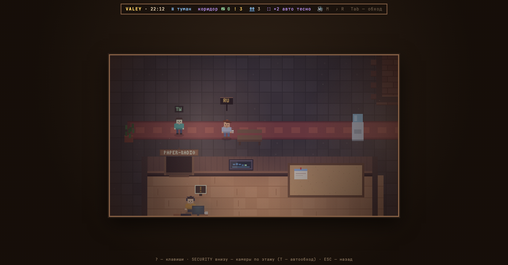
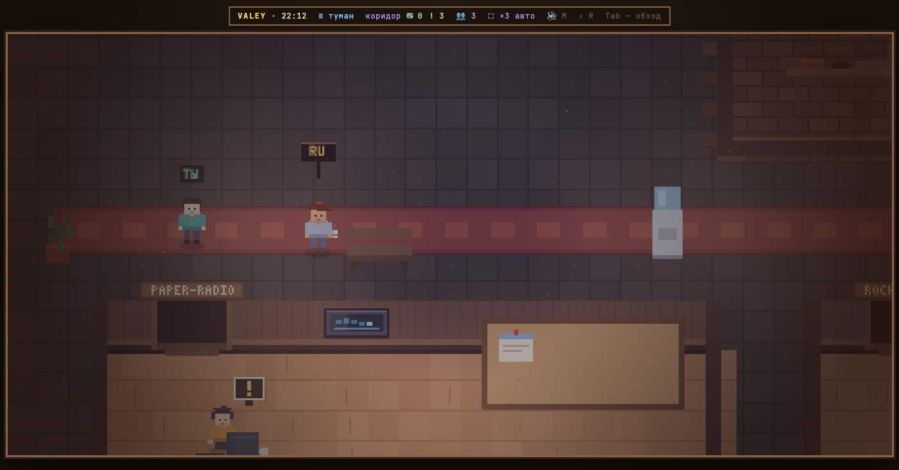

# v0.13.0 — 6 September 2026

## The canvas takes the window

*office*

This note was written after the fact, out of the changelog and two replayed frames. Notes start at v0.24.0; the handful before it exist because their before-and-after is worth being able to see. The words are not those of whoever built the feature.

The office used to be a picture in the middle of a page: a fixed canvas, black margins all round it, and a two-line strip of key hints underneath.

Now the canvas takes the window. The scale is a whole number of screen dots per game pixel, counted from the width — at least 400 pixels of world across — and everything the window gives beyond that goes into showing more floor, so a tall monitor shows more office instead of more black. The strip of hints went with it: the `?` panel says it all.

*Before, v0.12.0*

*After, v0.13.0*

**Keys**

- `+` `−` — pick the scale by hand
- `0` — hand the count back to the window

### What changed

### Added

- **modules:** a module route can read the office settings (9b68277)
- **office:** the strip along the bottom is gone, the ? panel says it all (463c65b)
- **office:** the canvas takes the window, so a tall monitor shows more floor (000e103)
- **agents:** the shift — replies, characters and the gaps between them (a1bf739)
- **modules:** a module can be handed the office stream and told who it is talking as (977aa6d)
- **modules:** a module can be handed the floor — who is standing where, and how to reach one of them (36e7b70)
- **meeting:** the office introduces two browsers to each other and then gets out of the way (cf67e26)
- **office:** the inventory grows a keys shelf, and the office says what it connects to (a281d81)

### Fixed

- **office:** changing the interface size recounts the office, without a reload (6ff1ea2)
- **test:** a range with several features is a fifth right answer, not a broken dry run (585c185)
- **hud:** the HUD grows with the interface, not with the office (61a1714)
- **office:** the copy icon no longer hides while the cursor is crossing to it (de6fa6f)
- **office:** a guest asked for the modules before he was let in, and got an office without any (723165f)
- **shot:** two shots at once photographed the same browser, so two people read as one (e8fe739)
- **test:** a branch whose main was released past it is not a broken dry run (55026b2)
- **office:** the inventory keeps one height across its five tabs (5031b0a)
- **office:** keys take the last tab, and the hint stops counting digits aloud (ac56e00)

### Other

- docs(office): the tree points at the Prod section it was promoted to (649a855)
