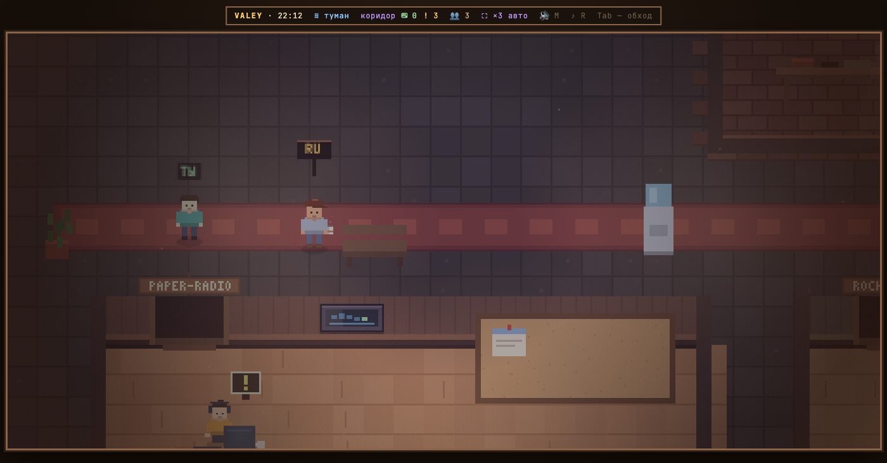
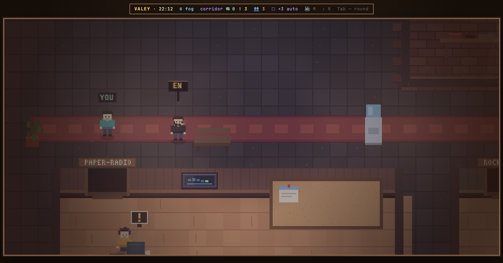

# v0.14.0 — 6 September 2026

## The office comes up in the language of the device

*office*

This note was written after the fact, out of the changelog and two replayed frames. The words are not those of whoever built the feature.

The office opened in Russian for everybody, whatever their machine was set to. Somebody arriving from a browser in English met «коридор», «туман» and «ТЫ» over their own head, and had to find the sign by the door before anything read.

Now it asks the device. The frames below are the same office one version apart, on the same browser: «коридор · туман · ТЫ · RU» becomes «corridor · fog · YOU · EN». The sign still stands by the door, and `SPACE` still switches — the difference is what happens when nobody touches it.

*Before, v0.13.0*

*After, v0.14.0*

**Keys**

- `SPACE` on the sign by the door — switch language

### What changed

### Added

- **lang:** the office comes up in the language of the device, not in Russian (de46eb2)

### Fixed

- **names:** «Костя» in the Russian pack was typed on the wrong layout (902d0b4)
- **title:** the entrance menu is laid out after the canvas, not before it (d150a16)
