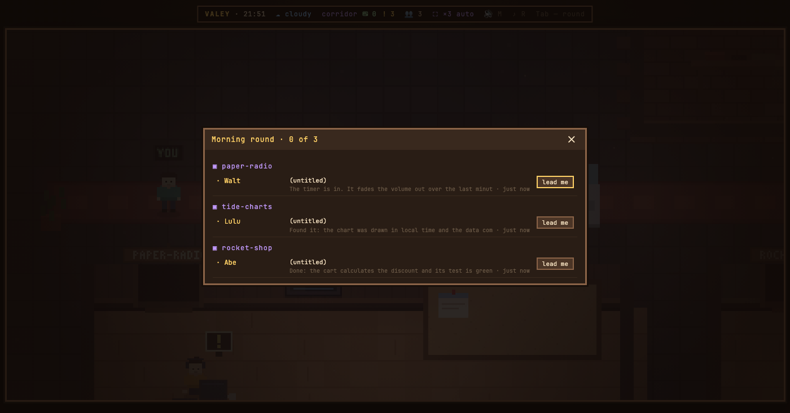
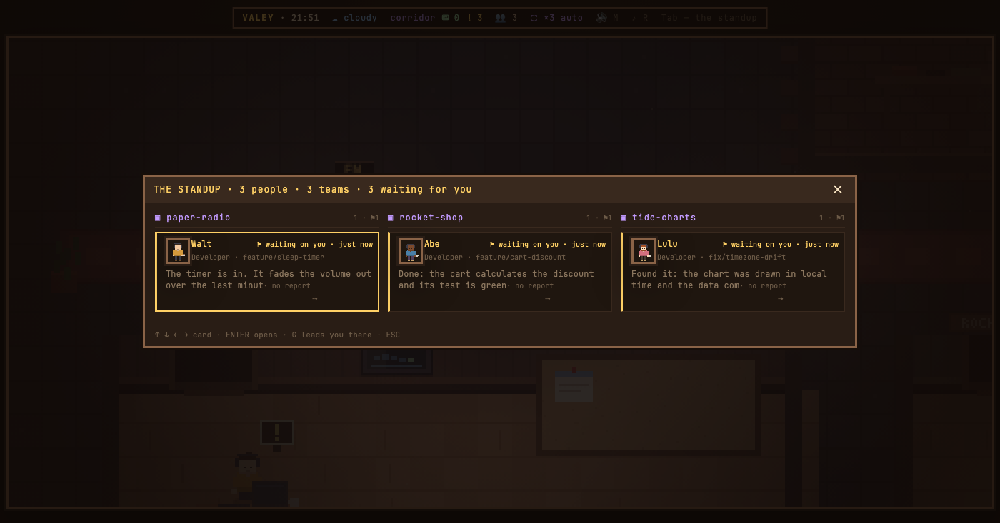

# v0.18.0 — 6 September 2026

## The standup — everybody by team, with the task they named themselves

*office*

This note was written after the fact, in September, out of the changelog and two replayed frames. Notes start at v0.24.0 and are not being backfilled — this one exists because the pair below is the clearest thing in the repository for showing what a before-and-after actually is, and a mechanism nobody can see the point of is a mechanism that gets dropped. The words are not those of whoever built the feature, and it should be read that way.

Before it, the panel was a morning round: one column, a project as a heading, a name, and `(untitled)` where the task should be — nothing in the office knew what anybody was actually doing, only which repository they were in.

Now it is the standup. People are grouped by team, side by side, each with their face, their role, the branch they are on, and the task in their own words. The header counts what matters before you read anything — three people, three teams, three waiting for you — and a flag marks the ones held up on you. The keys are in the panel: arrows move, `ENTER` opens, `G` walks you to the desk.

Both frames are replays: the same recipe walked through a worktree of v0.17.0 and one of v0.18.0. Neither is the office anybody had open that day, and the floor is the invented one the tests use.

*Before, v0.17.0*

*After, v0.18.0*

**Keys**

- `TAB` — the standup
- `↑` `↓` `←` `→` — move between the cards
- `ENTER` — open the one in focus; `G` walks you to that desk

### What changed

### Added

- **office:** the standup — everybody by team, with the task they named themselves (95e0984)

### Fixed

- **stands:** the comment guard could not see past a regex holding a backtick (911d82a)
