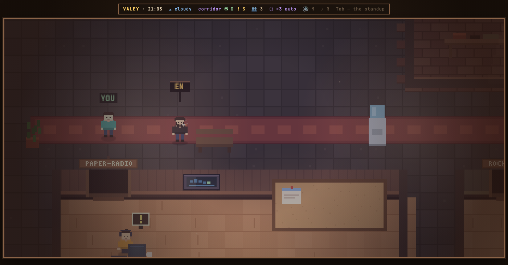

# v0.25.0 — 9 September 2026

## Feature notes carry pictures now

*notes*

A note that describes a pixel office in prose alone is describing the one thing it cannot show. The first release with notes said so out loud: pictures were deliberately left out, prose first.

A fragment can now declare shots, and each one is a recipe rather than a file — an id, a place to be, and the keys that get there. `node tools/notes-shots.mjs` raises a demo office, walks it through the recipe and puts the frame next to the fragment; the release moves the pictures under the version and keeps the recipes beside them in `shots.json`. Declaring a shot and never rendering it stops the release, the same way a missing note does.

The recipe is the half that matters later. A picture can only be looked at; a recipe can be replayed on an older tag, which is what a genuine before-and-after will be made of. That replay is not built yet.

The office in these frames is invented — three made-up people on three made-up projects, from the same fixtures the stands use. A photograph of a real office is a photograph of real project and branch names, and these files go to a public repository.

### What changed

### Added

- **notes:** a feature note can carry frames of the office (f029ed0)
