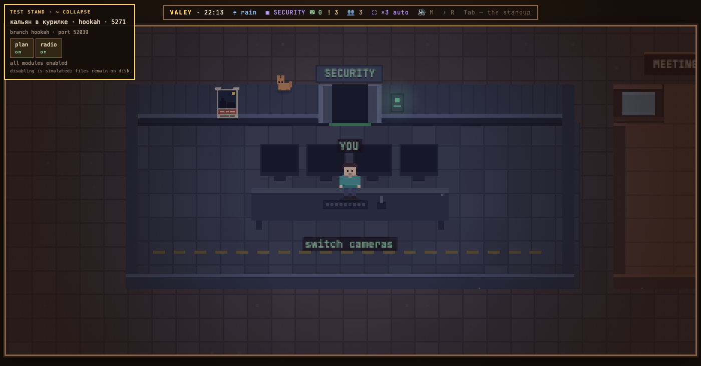

# v0.29.0 — 10 September 2026

## A hookah in the smoking room

*lounge*

The smoking room had a sofa, a sand bin with a wisp above it and the football table — a place to stand with a cigarette while a limit runs out, not a place anyone would call at ease. The people who end up there are the ones the office is being kind to, and the room said nothing of the kind.

Now a hookah stands between the two who smoke standing, a step in front of them: a low tray, a glass base with its water line, a brass stem, a clay bowl with a coal that breathes, and a hose resting its mouthpiece on the tray. Above it the sand bin's wisp grown up — four puffs, slower and wider, drifting. It is furniture, not a seat: nobody is pinned to it and the five places stay where they were. It answers to no key, and it was drawn straight into the code on the owner's word for a live demo; the frame followed the same day.

### What changed

### Added

- **lounge:** a hookah in the smoking room, for the people who are at ease there (1169a09)

### Other

- docs(notes): the hookah's note and its frame from the seeded office (76a4696)
