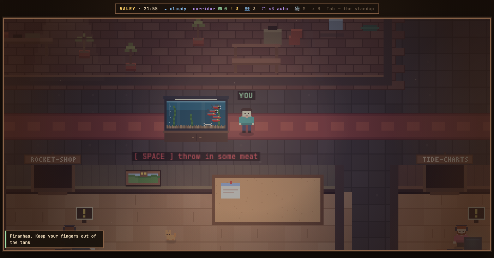
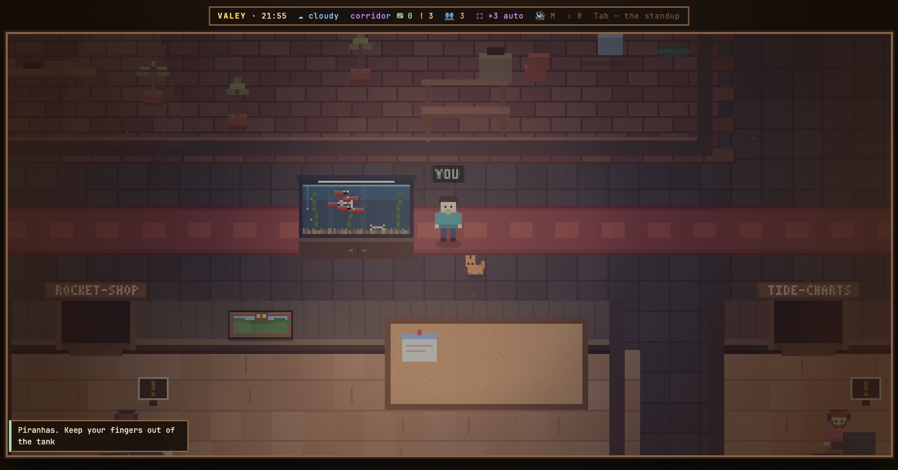

# v0.37.0 — 12 September 2026

## a piranha tank in the entrance corridor

*office*

The corridor you walk in through had a bench, a cooler and nothing that moved on its own.

Now there is a tank of five piranhas on a cabinet over the second room. Each fish swims a path of its own, every fifteen seconds the whole school darts at once, and a person standing at the glass draws them over to that side, teeth out. `Space` at the tank throws in the cartoon piece of meat — a pink chunk on a white bone: it splashes in, the school rings it and tears at it while it sinks, the water clouds, and the bone goes down to join a heap on the gravel that grows with every meal, up to six. One piece at a time — the line over the tank goes quiet until the bone lands. Left out on purpose: no counter of meals, no hunger that ever needs tending, and nothing in the tank bites the player.

**Keys**

- `Space` at the tank — throw in a piece of meat

### What changed

### Added

- **office:** a piranha tank in the entrance corridor — the fish notice you, and SPACE throws in meat (286cb10)

### Other

- docs(keys): SPACE's action line names feeding the piranhas, in all three copies (4769d49)
- docs(notes): the piranha tank's note, with the tank and a meal in progress (611b4ee)
