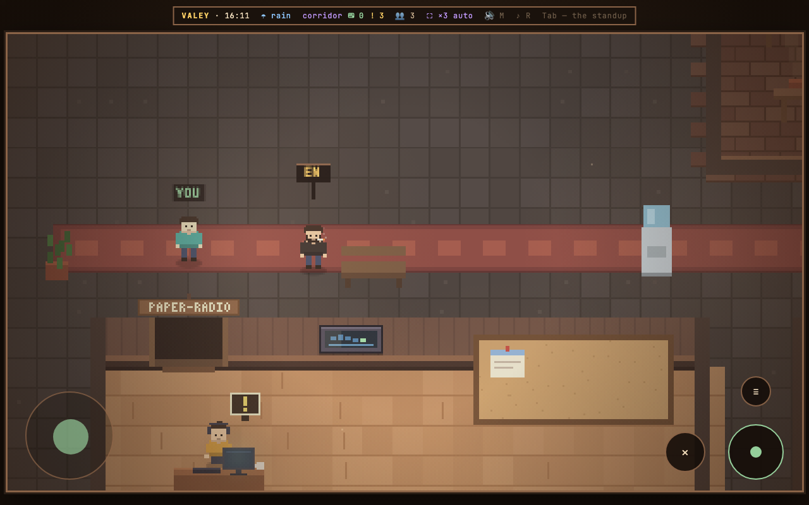
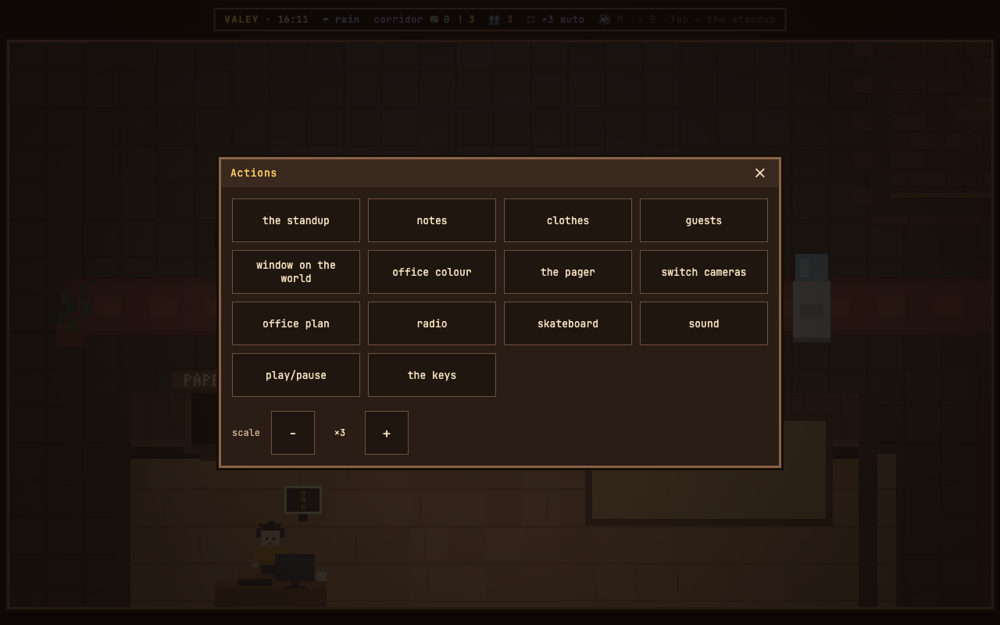
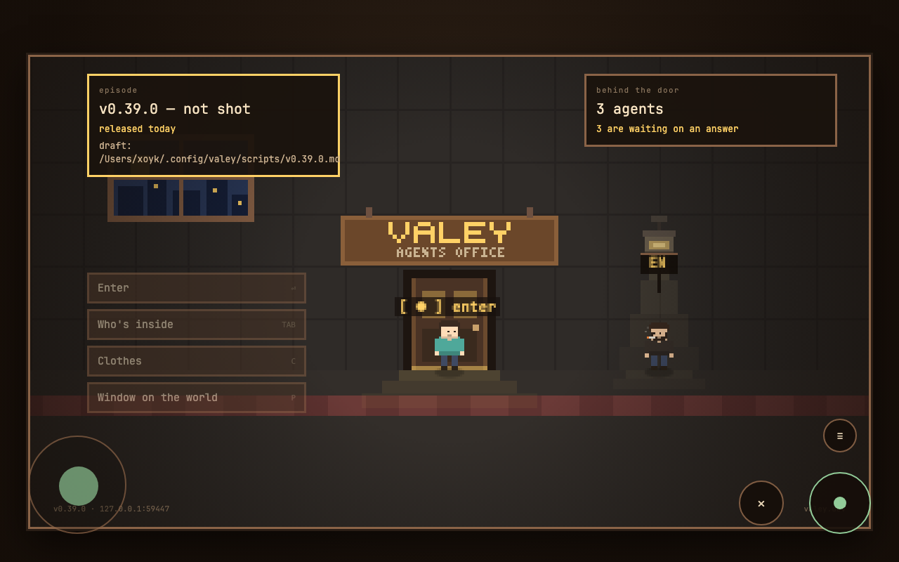

# v0.40.0 — 12 September 2026

## The office on a tablet

*touch*

The office reached a tablet over the network and then took nothing but a keyboard: the entrance screen wanted Enter, and the floor had not one handler for a finger. You could watch, and that was all.

Now a screen that reports a coarse pointer — or the first finger on one that did not — gets a layer of its own. A ring bottom left is the stick: a thumb landing anywhere in the left third takes the ring with it, tilt is speed as on a gamepad, and the rim is running. Bottom right, three buttons under the other thumb: ● is SPACE, ✕ is ESC, and ≡ opens a sheet of the panel keys written out as words — the roster, notes, the inventory, the plan, the window on the world — with the scale at the bottom. A button there presses the very key it names, so a module that declares a panel key gets a button the same day. Hints over things say `[ ● ]` where they said `[ SPACE ]`; the layer steps aside while any panel is open, and comes back when it closes. On the entrance screen the door and the language switch answer a tap, and ≡ is there too, with what the entrance does not answer dimmed rather than gone.

Deliberately left out: tapping the floor to walk there — the stick came first, a route through desks and people is the next step; the layout assumes landscape, portrait works but is not laid out for; the interface scale on touch stays at 100%. A mouse never wakes the layer.

**Keys**

- stick, bottom left — walk; tilt is speed, the rim is running
- ● — the same as SPACE: talk, drink, press what is selected
- ✕ — the same as ESC: back
- ≡ — the panel keys as words, and the scale; on the entrance screen too

### What changed

### Added

- **touch:** the office on a tablet — a stick, ● and ✕, and a ≡ sheet of the panel keys (9ee0a67)

### Fixed

- **touch:** the stick no longer goes deaf under a toast (dc4841f)
- **entrance:** the release nudge stays with the owner, and a guest's entrance does not carry it (b1b5760)
- **stand:** the plaque folds by a tap, for a screen that has no «~» (41e6594)
- **touch:** the first finger on a screen that did not call itself coarse takes the stick (a714e5d)

### Other

- docs(notes): the tablet's note and its three frames (6cd9703)
- chore(shot): the camera can pretend to be a tablet, and tap a button (e6e83fb)
- test(touch): the tablet's stick and buttons as arithmetic, with a stand (b870a12)
