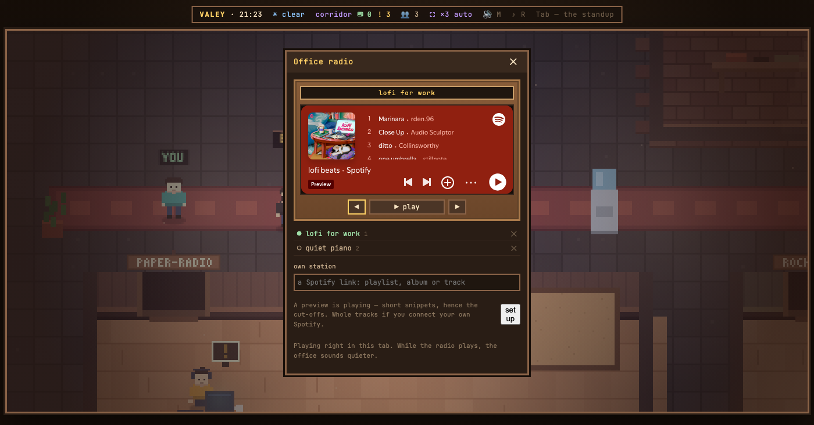
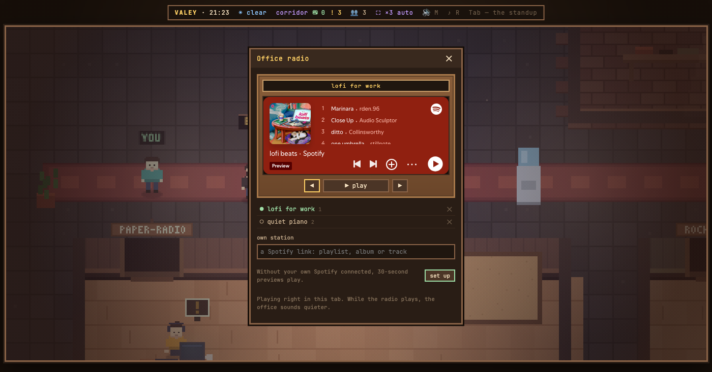

# v0.41.3 — 12 September 2026

## The receiver's «set up» is an office button again, and its line says what a preview is

*radio*

Without your own Spotify the receiver plays previews, and the panel says so under the player with a button that leads to the key card. Since 6 September that button had lost its style and drew as the browser's grey system button in Arial, the only one in the office; and the line above it explained the cut-offs — «a preview is playing — short snippets, hence the cut-offs» — instead of stating the terms.

Now «set up» is drawn like the rest of the office: wood, the accent edge, the office's font. The line says it in one sentence: without your own Spotify connected, previews of 30 seconds play.

**Keys**

- `R` — the radio, from anywhere in the office

*Before, v0.41.2*

*After, v0.41.3*

### What changed

### Fixed

- **radio:** the receiver says what a preview is in one line — 30 seconds without your own Spotify (d5b245a)
- **radio:** «настроить» in the receiver is a button of the office again, not the browser's grey one (f813697)

### Other

- docs(notes): the receiver's note, with the panel before and after (c92037a)
