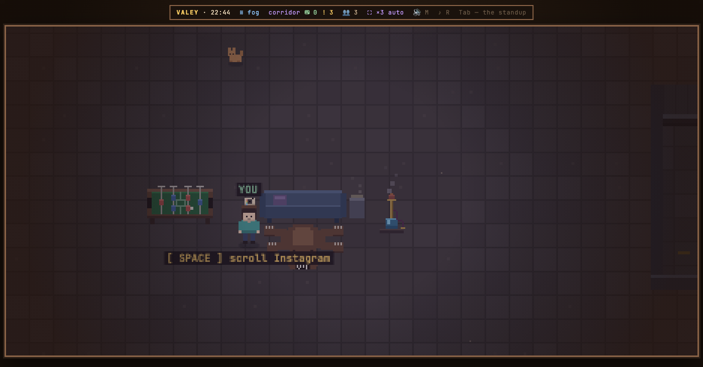
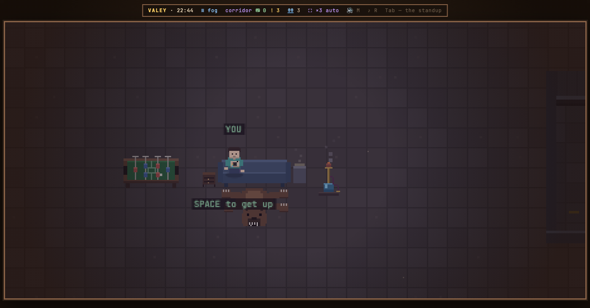

# v0.43.0 — 12 September 2026

## A polaroid in the lounge

*polaroid*

Agents work for minutes at a time, and in those minutes people wander off to scroll anyway — and miss the moment an agent finishes and waits for them.

Now a polaroid lies on a side table between the kicker and the sofa in the lounge. SPACE by it sits you on the sofa with the camera in your hands and opens Instagram in its own window: phone-wide, laid over the office's right edge, in your own browser and under your own login. While that window is open and an agent comes free and waits for you, the polaroid flashes and the browser posts a notification with the same line the office toasts; clicking it brings the office back. Closing the window, a step or SPACE gets you up in front of the table.

Deliberately left out: Instagram inside the office itself — instagram.com refuses to be framed, and the only way round is a proxy holding your login; reading anything from Instagram at all; any site other than Instagram. The browser asks about notifications once, on the first SPACE at the polaroid, and saying no leaves the flash, the toast and its sound.

**Keys**

- `SPACE` at the polaroid — sit down on the sofa and open Instagram over the office
- `SPACE`, a step, or closing that window — get up

### What changed

### Added

- **polaroid:** the Instagram window opens over the office's right edge, phone-wide and page-tall (c55781e)
- **polaroid:** a polaroid in the lounge opens Instagram in its own window and calls you back when an agent is free (536e763)

### Other

- docs(notes): the polaroid's note and its two frames (b5f69e3)
