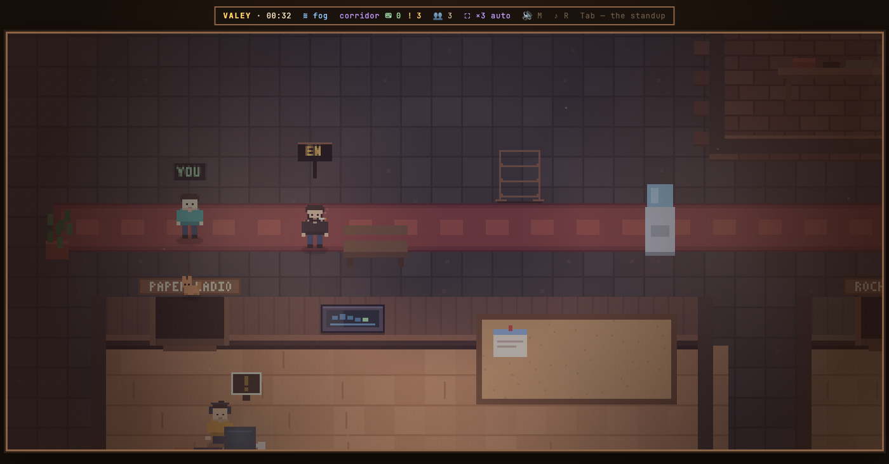
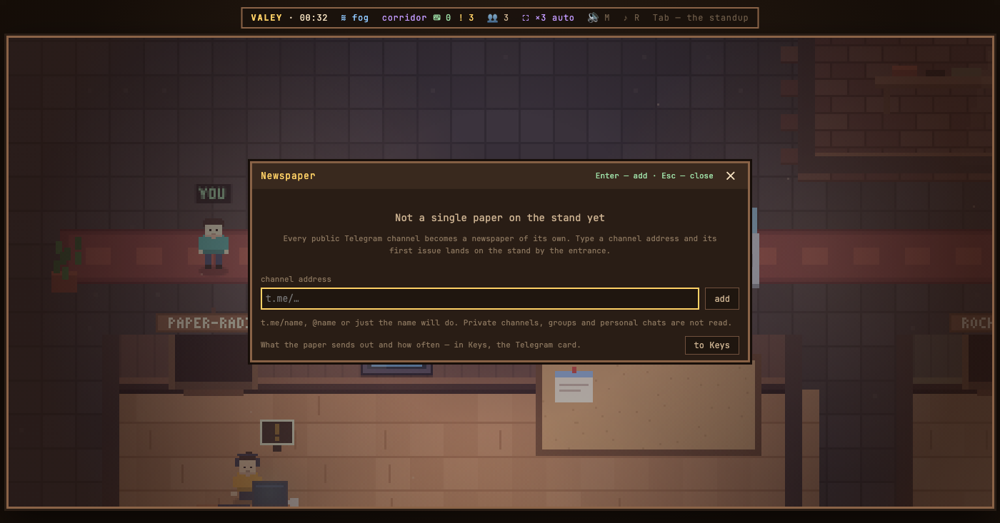

# v0.45.0 — 12 September 2026

## A newsstand by the entrance — public Telegram channels as newspapers

*newsstand*

Reading your channels meant leaving the office for Telegram, and a feed has no end — it is scrolled, not finished.

Now a wire stand in the entrance corridor holds a newspaper for every public channel you put on it. The masthead is the channel's name in the office's own pixel font, the newest post is the lead with its picture printed in two-colour halftone, the rest run in three columns, and views are the circulation. A yellow flag on the stand says something new came out; opening the paper takes it down. Add a channel by its address — t.me/name, @name or just the name — and take it off the same way; the Keys shelf has a Telegram card that says exactly what goes out.

What goes out is deliberately little: the office server fetches the open web feed t.me/s/<name> of the channels on the stand — no login, no token, no phone number — at most once per channel every fifteen minutes, and fetches the pictures itself, so your browser never talks to Telegram. With no channels on the stand it makes no request at all. Guests read the papers but cannot add any. Private channels, groups and personal chats are not read, and replies and reactions are left out: the paper only reads. One summary across all channels is the next step, not this one.

**Keys**

- `G` — opens the newspaper
- `Tab` — the next paper, then «+ channel»
- `+` — add a channel, with the caret already in the address field
- `←` `→` — an earlier or a later issue

### What changed

### Added

- **newsstand:** a channel is added from the keyboard — Tab reaches «+ канал», and + opens it (9f462c3)
- **newsstand:** public Telegram channels as newspapers on a stand in the entrance corridor (33580ad)

### Other

- docs(notes): the note for the newsstand (43ad14c)
- docs(readme): name the newsstand among the things that leave the machine, and its G key (1087782)
