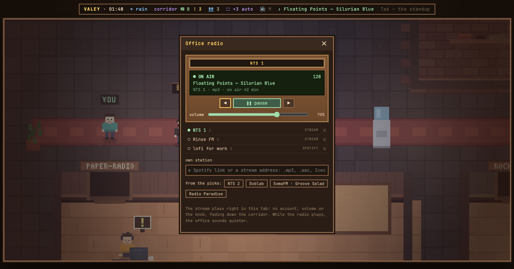

# v0.49.0 — 13 September 2026

## The office radio plays internet radio stations, no account needed

*radio*

Until now the receiver by the entrance played Spotify only, and without your own connected Spotify app that meant thirty-second previews breaking off mid-track. YouTube was considered first and turned down: its API terms forbid a player that is not shown on the page and sound separated from the picture, which is exactly what a radio in a corridor is.

Now «своя волна» takes the address of a stream as well as a Spotify link: .mp3, .aac, Icecast, Shoutcast, or a .pls playlist. The office's server checks the address first — does it answer, is it sound, what format and bitrate — and says so in one line: «✓ это поток: отвечает · mp3 · 128 kbps». An address carries no name, so the receiver asks for one, filled in from what the station calls itself. Enter catches the wave, Esc cancels. A row of four picks — NTS 2, Dublab, SomaFM · Groove Salad, Radio Paradise — adds a station in one press.

A stream plays in the page's own audio element: whole tracks, no account, volume on the knob, quieter as you walk off down the corridor, and the office steps back while it plays. Instead of Spotify's glass the receiver shows a display: on air, bitrate, what the station says is playing (read by the server every twenty seconds, since the browser is not allowed to read it), and for how long. The list marks each wave ПОТОК or SPOTIFY.

When a stream is silent the display says why and what to do, and the wave stays in the list: no answer in ten seconds; HLS (.m3u8), which browsers do not play; an http stream on the office's https page; the station closed the stream (404).

The server only ever talks to stations the owner added or picked, and only while checking or playing one. Checking and the track title are the owner's: a guest's receiver plays streams just the same, but cannot send the office's server to arbitrary addresses. Mixcloud and SoundCloud are the next step and not part of this one.

### What changed

### Added

- **radio:** the receiver plays internet radio by its stream — no account, a display that says what is on and why it is silent (50f575f)

### Fixed

- **radio:** removing a wave nobody is listening to no longer breaks the music off or restarts the playlist (9660f1d)

### Other

- docs(notes): the radio-stream note shows the receiver on the air (67827fc)
- docs(notes): the note for internet radio streams (b44d841)
- test(radio): a stand for streams — the pasted line, a station's answer, playlists, ICY titles and who may ask (c09535d)
