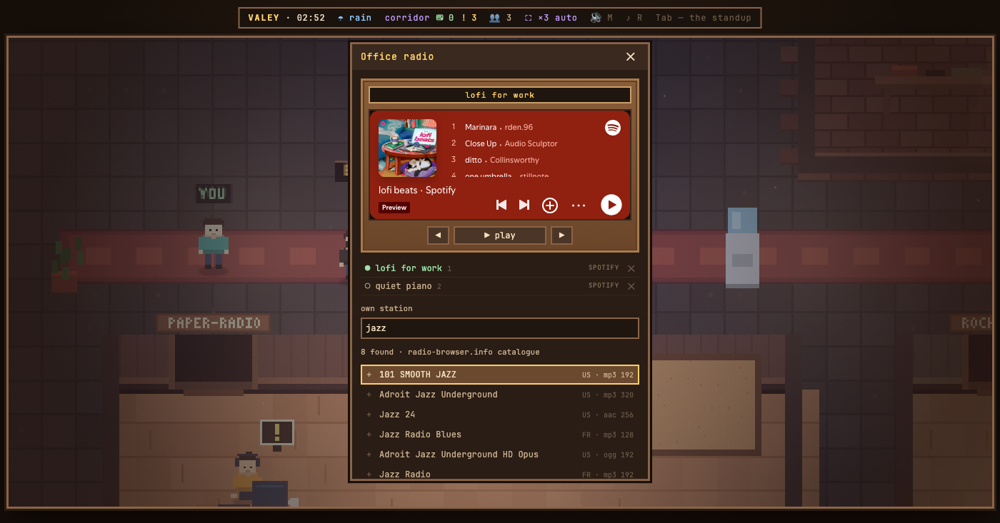

# v0.50.0 — 13 September 2026

## The office radio finds stations by name or genre

*radio*

Until now a stream had to be found somewhere else first: stations hide their stream address behind the player on their website, and a .pls or .m3u file is not something most people open. The receiver took an address or nothing.

Now «своя волна» is also a search. A Spotify link is still a Spotify wave and an address is still a checked stream, but anything else — «jazz», «NTS», «Маяк» — is looked up in the open radio-browser.info catalogue on Enter. Up to eight stations come back under the field, most popular first, each with its country, codec and bitrate; the arrows walk them, Enter or a click tunes in and starts playing. A station already in the list is marked ✓ and is tuned to rather than added twice. Esc goes back to the picks, and a second Esc closes the panel.

Under the picks is a row of genres — jazz, ambient, lo-fi, techno, classical, news — each a single tag the catalogue is known to carry, because its own tags are too messy to offer as they are. While the catalogue is thinking the line under the field says so; when nothing is found, it suggests a genre and leaves the genre row in sight; when the catalogue does not answer, it says to paste an address instead. HLS streams and stations the catalogue did not find on the air at its last check never appear. An http station on the office's https page is shown but cannot be caught.

The search is new traffic leaving the machine, and it is kept small: the office server sends the typed word or the genre to the catalogue only on Enter or a press, never as you type, and nothing about the office goes with it. A station you play is reported to the catalogue as one click, which is how it ranks stations. Searching is the owner's, like checking a stream: a guest's receiver keeps the address field and the picks.

### What changed

### Added

- **radio:** the receiver finds stations by name or genre in the radio-browser catalogue (2296547)

### Other

- docs(office): the kitchen corner points at its frame on Prod, not the WIP section it left (05f62f2)
- docs(notes): the note for finding stations, with the results on camera (c9e59df)
- test(radio): a stand for the station search — the filters, the tag top-up, genres, clicks and a guest (128124d)
