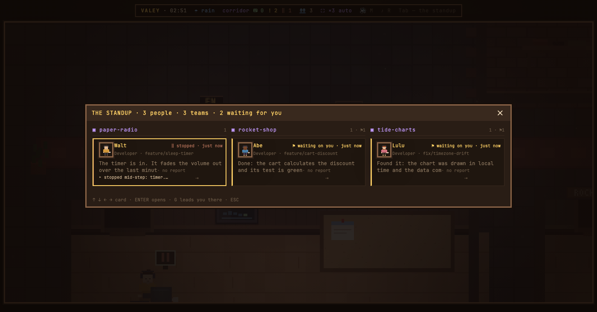
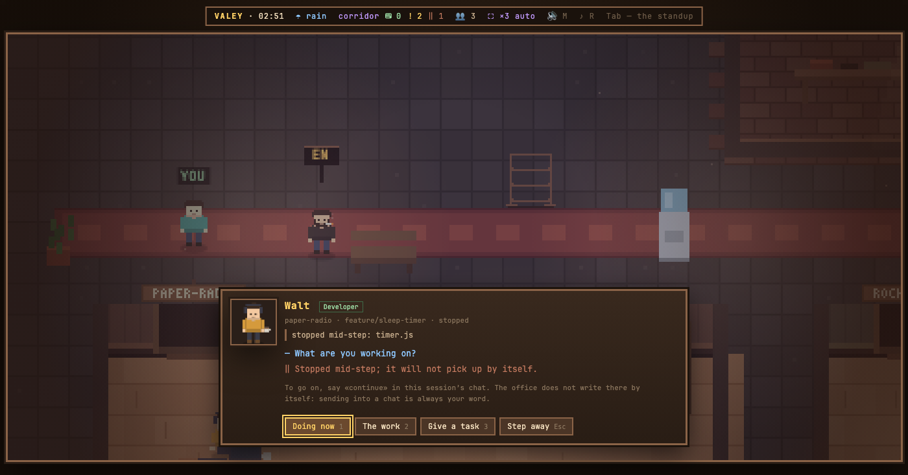

# v0.52.0 — 13 September 2026

## An agent cut off mid-step shows «stopped», not «waiting on you»

*office*

An agent that was interrupted used to look exactly like one that had finished and was asking for something: the blinking «!» over its head, the yellow stripe on its card, a place in «! N» and on the pager. Most interruptions are not a person pressing Esc — twenty of twenty-one in four days came right before the app resumed the session, which means the process was restarted — so the office said «waiting on you» about agents that were asking for nothing and would not go on by themselves.

Now an interrupted agent is **stopped**, drawn in its own colour. Over its head a still «‖» that does not blink; on its card «‖ прервано» with the step it was cut off at; in its dialog a line where the reply would be, saying the way on is «continue» in the session's own chat. The HUD counts them with a chip of their own, «‖ N», because a restart cuts every agent off at once and without a number that is found only by walking the floor. The chip is not a button and stopped agents stay out of «! N» and the pager: sending into a chat stays your word, and the office does not do it for you. The floor plan colours them the same way.

Still reading as «waiting on you»: an API error, which leaves the app back at the prompt with nothing to retry.

### What changed

### Added

- **office:** an agent cut off mid-step is «stopped», with a chip of its own, not «waiting on you» (bbb1ced)

### Fixed

- **office:** a stopped card's last line is muted, not the green of an agent at work (0acca76)

### Other

- docs(notes): the stopped state's note, with the standup card and the dialog (d180159)
- chore(notes): a picture recipe can interrupt a demo agent before the camera (b907bb9)
