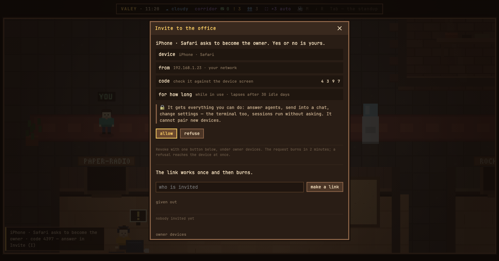

# v0.53.0 — 13 September 2026

## A phone or an Xbox in your network becomes the owner after your yes

*office*

Until now there were two owners of an office and no third: this computer, and whoever held the owner link. A phone that came in with the network code could watch the live feed and answer nothing — its «Ответить в офисе» led to the office's title screen.

Now a device in your own network asks to become the owner, the way a Bluetooth device pairs: it shows four digits, and the office on this computer opens Invite with a request carrying the same four digits, where it came from, and what it will get — everything you can do, the terminal included, since sessions run without asking. «разрешить» or «отказать»; the request burns in two minutes. A paired phone or Xbox is the owner from then on, in the feed and in the office alike: the same token is read by both, because they share an address.

Under the invitations there is now a list of owner devices — this computer first, then each device with when it was paired and last seen, and «отозвать». The office prints the list in the terminal at every start.

Deliberately not in: pairing from outside your network (a request through a tunnel or a proxy is refused, and so is a paired device's token there), and a paired device letting in the next one — only this computer or the owner link answers a request. A device unused for thirty days lapses, and the office keeps only a hash of its token.

**Keys**

- `I` — the request with its four digits, and the list of owner devices

### What changed

### Added

- **office:** a phone or an Xbox in your network becomes the owner after your yes in Invite (ed28d71)

### Other

- docs(notes): the note for owner devices, with the pairing request on the picture (d45f966)
- chore(office): the server pairs owner devices by a four-digit code, answered only from this machine (4103f55)
