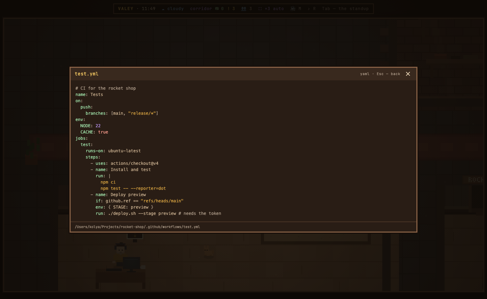
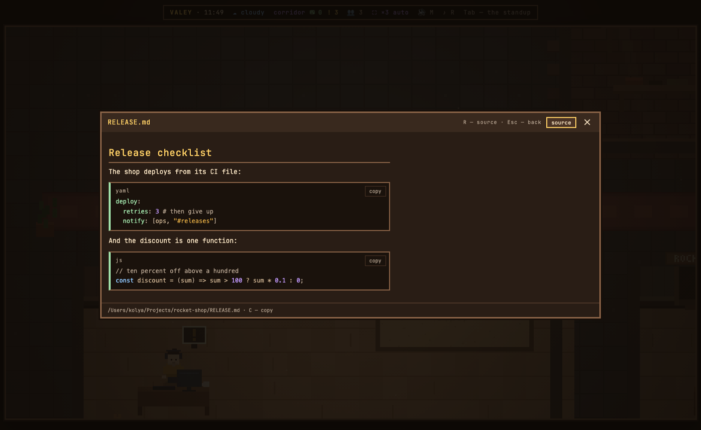

# v0.54.0 — 13 September 2026

## YAML files are highlighted on the board, and comments in code read at last

*board*

A `.yml` or `.yaml` file an agent touched opened on the board as plain text — a CI workflow, a compose file, a config — and a yaml code block in a markdown document did the same. Both are highlighted now, in the colours the board already uses for JSON and JavaScript: keys like JSON keys, strings, numbers, `true`/`yes`/`~` as literals, anchors and tags, comments.

A block after `run: |` or `key: >` stays one piece of text, so a shell line such as `echo a: b` inside a CI step does not come out as a key, and a `#` inside a quoted string or a URL is not taken for a comment.

Comments and punctuation in code were dimmer than the rest of the office's small print — 2.9 to 1 on the board, 3.5 inside markdown blocks. They take the office's one readable muted tone now.

### What changed

### Added

- **board:** YAML files and yaml blocks in markdown are highlighted (e7fa628)

### Fixed

- **board:** comments and punctuation in code read on the board and in markdown blocks (38b2dd1)

### Other

- docs(notes): the note for YAML on the board and readable comments in code (5001c08)
