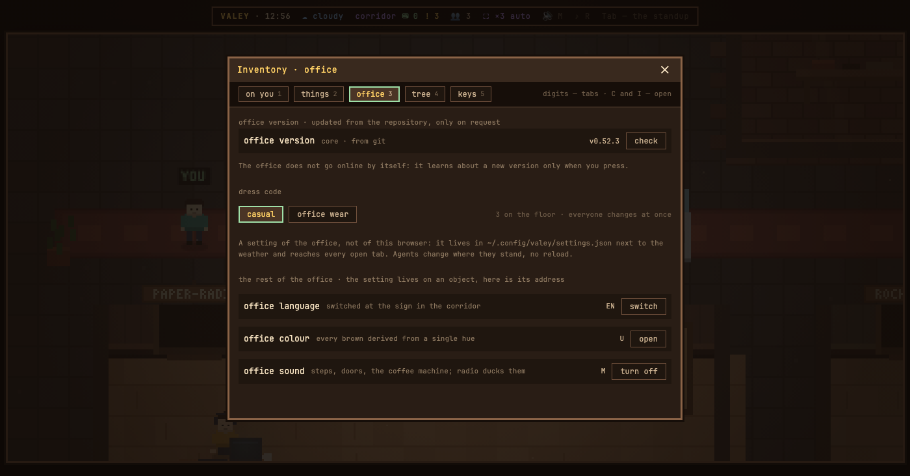

# v0.55.0 — 13 September 2026

## The office updates itself from its repository, without stopping

*office*

Updating the office meant stopping it: Ctrl-C, `git pull` in the core, `git pull` in the Modules, `npm start`. Whatever the office kept in memory went with it — guests' access, the notes on the desks, the questions it was holding for agents.

Now the office tab opens with a version row. **Check** asks the repository what is new — the version and how many features and fixes — and **update** pulls the core and the Modules and swaps the running office for the new one. `npm start` now runs a small supervisor that holds the port, so nothing is dropped on the way: guests keep their access, notes stay on their desks, a question held for an agent comes back held by the new office, and every open page reloads onto it and says «office updated». `npm run update` does the same from a terminal. When an update cannot go — uncommitted changes, a branch with commits of its own, a new server that will not start — the row says why in words, and the running office is left exactly as it was.

Left out on purpose: the office never checks by itself. Checking is a trip to git, and the office goes outside only when asked; a background check may come later as a setting, off by default. A Ctrl-C is still a restart and still forgets guests' access.

**Keys**

- `C`, then the office tab — the version row is the first thing in it

### What changed

### Added

- **office:** the office updates itself from its repository without stopping — a version row in the office tab (118dd06)

### Other

- docs(notes): the picture for the office-update note, rendered from its recipe on the demo office (8c18120)
- docs(notes): the note for updating the office without stopping, with the version row in the picture (37f3778)
- chore(update): npm run update does from a terminal what the office tab's button does (1173c69)
- chore(keys): the first ↓ in the office tab lands on «check for updates», and the light stays on it while it runs (515bd0f)
- chore(update): npm start runs the supervisor, and a stand proves the swap drops nothing (9f7a35b)
- chore(update): a supervisor holds the port and swaps the office under it without dropping anything (82c8361)
- chore(update): the office can check its repositories and pull them forward, both or neither (9510ecd)
