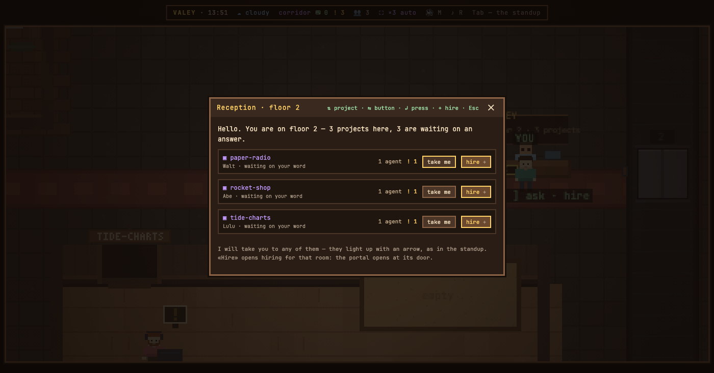
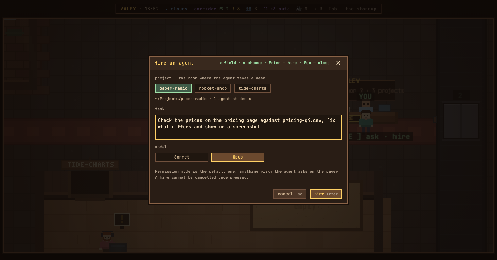
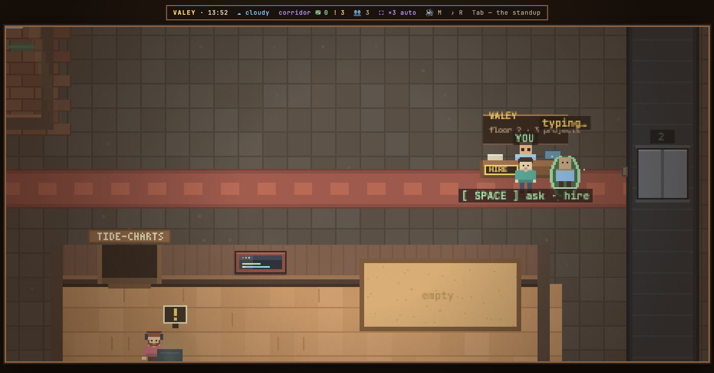

# v0.56.0 — 13 September 2026

## The office hires agents — a portal opens beside you and the new agent walks to its room

*office*

Until now an agent came into the office only from a terminal or the desktop app. A task that turned up in the office — a letter, a card on the board, a note — could not be handed to anyone without leaving for another window.

Now the reception desk hires. Its panel has «нанять» next to every project on the floor: the arrows reach it like any button, and `+` hires into the project under them straight away. The hiring panel opens with the caret in the task, the room already chosen at the desk; the room and the model — Opus by default, Sonnet one arrow away — are switches a `Tab` away. It says what it will not do: the permission mode is the ordinary one, so anything risky the agent asks on the pager like everyone else, and a hire cannot be taken back once pressed. A portal opens a couple of steps beside you and the agent prints itself line by line while `claude` starts, then walks off down the corridor to its room — a hire into a far room is seen happening rather than turning up out of sight. The portal follows the process, not a timer, and a run that fails to start leaves a red ring saying so instead of a person.

The new agent is an ordinary Claude Code session: its transcript is on your disk, it takes a name and a desk, and its card says «нанят из офиса» and when. Once it has answered, the card copies `claude --resume <id>` with the folder in front of it; the office lets the agent go first, so it leaves the floor and two processes never write one transcript. While it works there is no such button, for the same reason. The office is not the agent's lifeline either: stop or restart the office mid-task and the agent finishes what it was doing and goes.

The page names a room, never a path — the folder is taken from the agents already working in that project. Hiring is the owner's alone: a guest sees the desk and the portal, and the panel tells them only the owner hires. Modules can open the panel with a task already written; the smart mail is the first that will, and a letter reaches the agent as a quotation marked as someone else's text, never as part of the task. There is no tmux and no live Claude Code screen inside the office — watch it on the floor, continue it in a terminal.

**Keys**

- `SPACE` at the reception desk — ask, and hire
- `↑` `↓` in the reception panel — the project, `←` `→` — «проводить» or «нанять», `+` — hire into the project under the arrows
- `Tab` in the hiring panel — the room, the task, the model; `←` `→` on the room and the model — choose; `Enter` hires, `Esc` closes

### What changed

### Added

- **office:** the office hires agents — a new session starts at the reception and walks out of a portal at the room's door (6dbc0b3)

### Fixed

- **office:** a hire into a far room is seen — the portal opens beside the owner and the agent walks to its room (def73d9)
- **tree:** the module tree's lines and borders are the frame's tone, not a step darker (4e5d735)
- **radio:** the receiver scales its own panel only, and keeps the digit on its stations (ba48cdb)
- **office:** the reception's arrows reach «нанять», and the hiring panel picks its room with arrows instead of digits that typed into the task (507197d)

### Other

- docs(notes): hiring opens the portal beside you — the note, the README line and the pictures (640ff44)
- test(styles): a module's stylesheet cannot repaint the office (856dbdf)
- refactor(style): the core stops carrying the git tree's diff styles (81ba78a)
- docs(notes): the hiring note says the arrows, not digits, and its pictures are retaken (f1f3188)
- docs(notes): the note for hiring, with the reception, the panel and the portal (5e27642)
- docs(readme): + at the reception desk hires, and what a hire runs (4cbb14e)
- test(hire): a stand for hiring — the first message, refusals, a run that starts, stays and is let go, and one that never starts (7551ccb)
