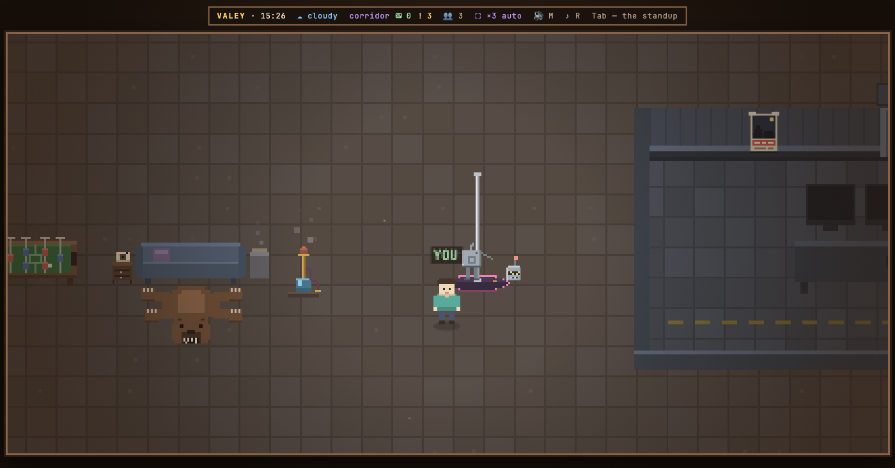

# v0.57.0 — 13 September 2026

## A pole in the lounge, and Bolty, the robot who dances on it badly

*office*

The lounge had a sofa, a hookah, table football and a bear skin, and nothing that did anything on its own. Now a round stage with a neon rim stands between the hookah and the control room, a chrome pole rises out of it, and Bolty dances round the pole — a tin robot with a visor, a grille for a mouth and an antenna that never keeps still. He is in the spirit of the clumsy robots of cartoons rather than a copy of any of them, and he is sure he is good at this: he spins with a stutter, climbs a little, and once a loop slips down the chrome in a shower of sparks and sits on the stage to recover.

`SPACE` at the stage throws him a coin. It flies from where you stand, he spins three times as fast and climbs — and then either slides down on his seat or spins his own head off, gropes about the stage for it, puts it back and bows. Either way he says something he believes is dignified. The coins pile up on the edge of the stage, and the count rides next to his name.

Nothing of it leaves the page: the show and the tips are yours and your tab's, the robot is drawn from the clock, and a guest standing next to you sees him dance but not your coins. The design phase was skipped on the owner's word on a live demo; the frame is owed afterwards.

**Keys**

- `SPACE` at the stage — tip him

### What changed

### Added

- **office:** a pole in the lounge, and Bolty, a tin robot who dances on it badly — SPACE tips him (de82074)

### Other

- docs(notes): the note for the pole and its robot, with the head coming off (3b54dab)
- docs(readme): SPACE tips the robot on the pole in the lounge (13a6146)
