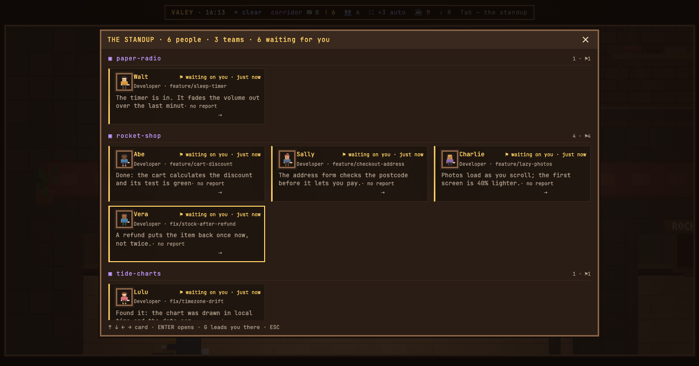

# v0.58.0 — 13 September 2026

## The standup gives a project the whole width, and its name stays in sight

*office*

The standup gave every project a column of its own. A project of seven people was a column of seven cards with the rest of the panel empty beside it, and the down arrow carried the project's name away with the first card — from the middle of the column nobody could say whose people these were.

Now a project takes the whole width: its cards run one after another in three columns at the usual scale and in two at 175%, and projects stand one under another. The project's name and its count stay pinned at the top while its cards scroll under them, until the next project pushes it out with its own. The arrows walk the cards as they stand — up and down a row at a time, across projects, sideways in reading order; ENTER, G and ESC are as they were.

The order of projects and of people inside them has not changed. Folding a project away or filtering by one is not part of this.

**Keys**

- `↑` `↓` — the row above or below, onto the card straight over or under, on into the next project
- `←` `→` — the neighbouring card in reading order

### What changed

### Added

- **office:** the standup gives a project the whole width, and its name stays pinned while you arrow down (ceb0a6a)

### Other

- chore(notes): the demo cast puts four people in rocket-shop, so a project's row shows in the pictures (71b32bf)
