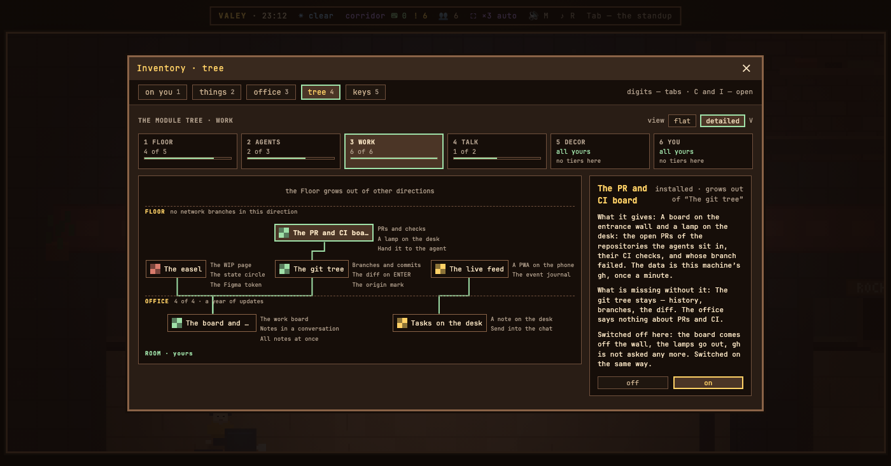

# v0.59.0 — 15 September 2026

## An installed module is switched off and back on from the module tree

*office*

A paid module you had no use for today could only be removed: take its folder out of `modules/`, or edit its `module.json`. Neither is something the owner of an office should have to do, and both are easy to forget to undo.

Now the card of every installed module in the inventory's tree (`C`, then `4`) carries a switch, «выкл | вкл». Switched off, the module stops: its server half is not run, its client is not loaded, its routes answer 404 — but its folder stays on disk and its node stays in the tree, dimmed, still counted as bought. `ENTER` on the node does the same as the buttons. The choice is kept in the office's settings, so it survives a restart and an update, and it is the owner's alone: a guest sees neither the switch nor the switched-off node.

The tree also gets its first node that grows out of another paid node: «Табло PR и CI» hangs under «Дерево гита», and it is the module this switch was designed for — a board that asks GitHub once a minute is not what every office wants.

Left out on purpose: switching a module off on a page that is already open without reloading it. A module's client cannot be taken back off a running page, so the switch reloads it, the way the stand's switches already do.

**Keys**

- `ENTER` on an installed module in the tree — switches it off, or back on

### What changed

### Added

- **tree:** an installed module is switched off and back on from its card in the module tree, and the PR board has its node (6473101)

### Fixed

- **office:** a delivered or hired session no longer inherits the office's settings, port and stand plaque (1cb25eb)

### Other

- refactor(tree): the module switch is the office's segmented control, as its frame is (a8fb9a4)
