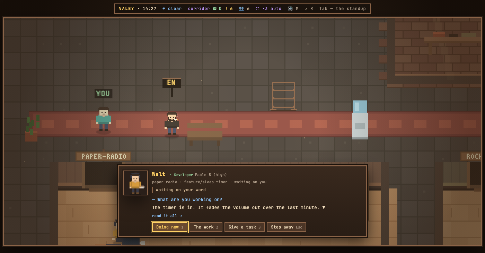

# v0.60.0 — 15 September 2026

## The agent card names its model and reasoning level, and a trade wears a pixel icon instead of a border

*office*

Sessions in the office run on different models, and the card never said which. Now it does, right after the trade: «Fable 5 (high)» — the model that wrote the agent's last reply, in a person's words rather than its id, and in parentheses the reasoning level it thinks at. Switch with `/model` or `/effort` and the card follows from the next answer; a one-turn boost shows only while that turn runs. A model the office has not heard of yet is shown by its id, not hidden.

The trade itself lost its border. A box around the text could never sit on the same line as the name beside it, so each trade now has a small pixel icon in its colour — `>_` for code, a pencil, a magnifier, a list, a tick, an arrow to the shelf — standing on the baseline with the letters.

A guest sees the model too: which model answers is a fact about the desk, like the trade, not about the work.

### What changed

### Added

- **office:** the agent card names its model and reasoning level, and a trade wears a pixel icon instead of a border (cf77577)

### Fixed

- **dossier:** the model no longer reads «<synthetic>» after an API error or a resume (f368269)

### Other

- test(language): the guard reads what a stand prints, not only its label — failure details, assert messages, summaries (a054abf)
- chore(stand-stop): the stand stopper reports in English (ab2da9c)
- test(stands): failure details, assert messages and summaries print in English, as the rule has said since 9 September (3406dc2)
