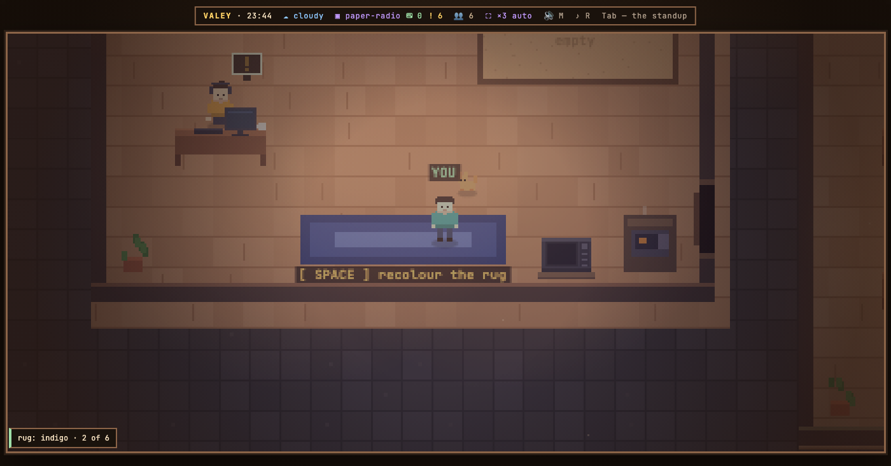

# v0.61.0 — 15 September 2026

## Each room's rug takes its own colour

*office*

Every project room had the same terracotta rug, and the floors tell rooms apart by only five tones, so neighbours often matched. The rug is the biggest patch of colour in a room, which makes it the obvious thing to recognise your own room by from the doorway.

Now the owner stands on a rug and presses `SPACE`: it takes the next of six colourways — terracotta, indigo, emerald, mustard, plum, graphite — and a toast says which one and where you are in the circle. The pattern stays the same, only its three tones change. The choice belongs to the office, not the tab: it is kept in `~/.config/valey/settings.json` next to the dress code, so every open tab repaints at once and a restart keeps it. A room nobody has recoloured stays terracotta, so an office where nobody presses anything looks as it did yesterday.

A guest gets no hint on the rug: to them it simply lies there. The runners in the corridors stay red, since `SPACE` there is the skateboard jump.

**Keys**

- `SPACE` on the rug of a project room — the next of six colourways, round the circle

### What changed

### Added

- **office:** each room's rug takes its own colour — SPACE on the rug walks six colourways (151e7c7)
