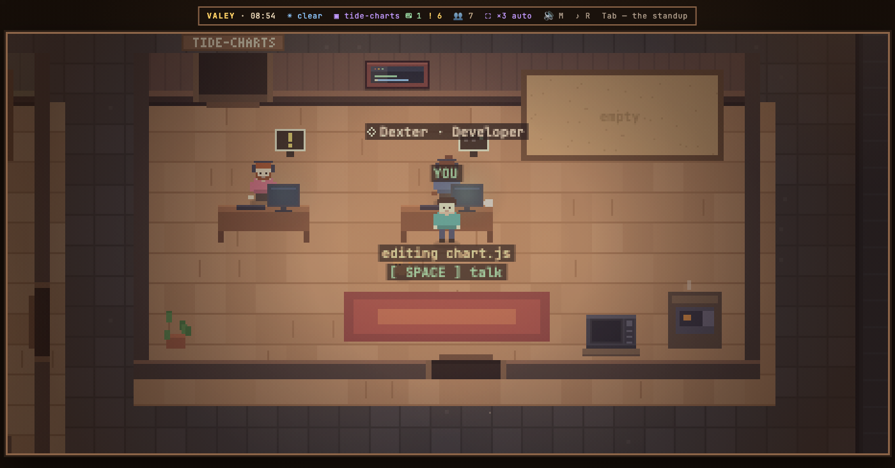
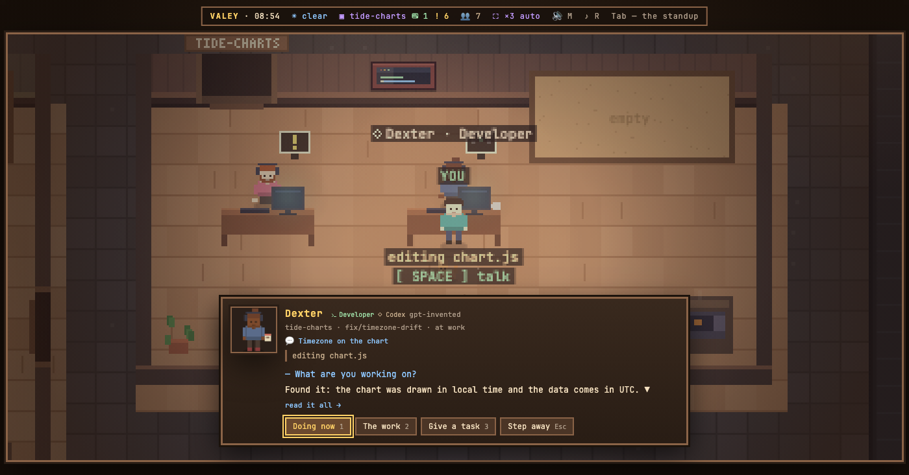
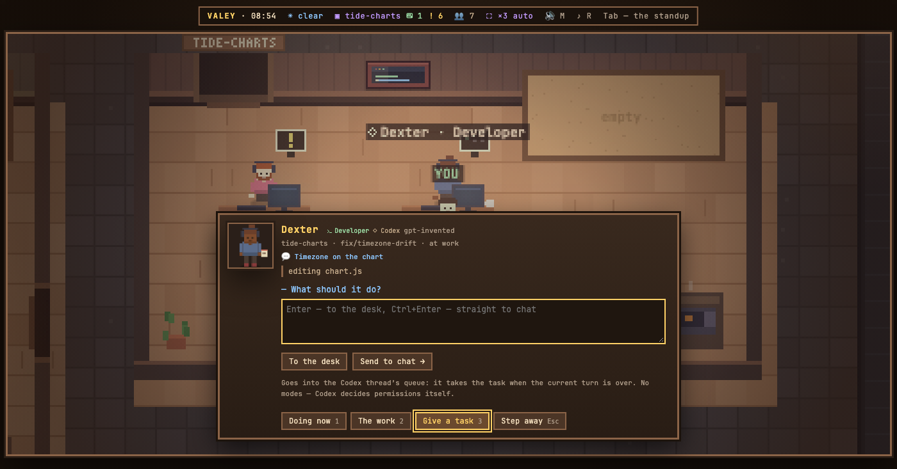

# v0.63.0 — 23 September 2026

## Codex threads sit at desks next to Claude sessions

*office*

The office only knew Claude Code. Whoever also worked in Codex had half the team off the floor: those threads were busy, finished, waiting on a reply — and none of it could be seen without opening the Codex app.

Now Codex Desktop and CLI threads take desks in their project's room next to Claude sessions: a name, a face, a role from the tools they reach for, what they are doing, the branch, the thread's name as the app shows it, and «waiting on you» or «at rest» read off the report their last reply ends with. Each source has its mark — ✶ Claude and ◇ Codex — before the name on the floor and after the role in the card. A thread is in while a Codex process holds its lock, so a closed thread leaves its desk the way a closed Claude session does; Codex's own helper threads are not seated.

«Give a task» works for Codex too. The task goes into the thread's own queue through `codex queue`, and Codex takes it in when the turn in progress is over — in the open Codex window as well — so the note on the desk says «queued in Codex» and the answer arrives in the conversation. There is no mode to pick: permission modes are Claude's, Codex decides its own.

Left out on purpose: answering a Codex permission request from the office. Codex does not write those requests to its files at all, so the office cannot see an agent waiting for one; Codex has hooks shaped like Claude's, and that is a separate step.

### What changed

### Added

- **office:** Codex threads sit at desks next to Claude sessions, marked ◇ where Claude is ✶ (b74c819)

### Fixed

- **office:** a file dropped into a task for a Codex thread goes with it, instead of being left behind (4a4c997)
- **office:** a Codex agent takes a task from the office — it goes into the thread's own queue (2f411ef)

### Other

- docs(notes): the Codex pictures re-rendered after main caught up (89a5a3a)
- docs(notes): the Codex note says tasks go into the thread's queue, with the Task page (0b88de8)
- docs(notes): the Codex sessions note, with the floor and the card (8485473)
- chore(notes): the demo office for release pictures seats one invented Codex thread (cde65bf)
- refactor(agents): one function records a tool call, whoever made it (de054f6)
