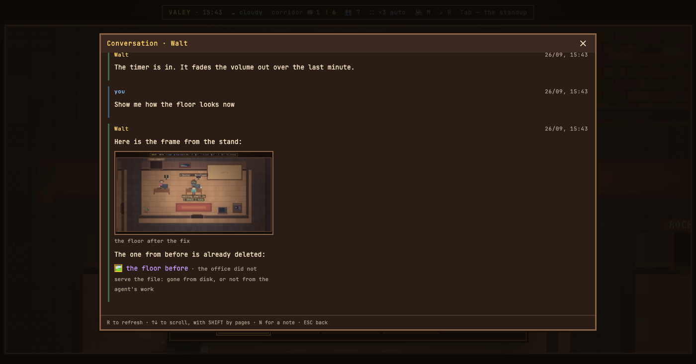

# v0.65.0 — 26 September 2026

## A picture an agent sends in a reply is drawn, not spelled out

*office*

An agent that draws something — a rendered frame, a screenshot of the layout it has just fixed — sends it back as ``. Until now the office printed that line as it stood: the path was visible, the picture was not. In the conversation the file is now drawn where the line used to be, with its name under it; a click opens it in the same viewer the files on the desk use, with zoom and arrows.

The picture comes through `/api/file`, which serves an agent's own work: files it opened or wrote, and now also a picture it names in its own reply — png, jpg, gif or webp, by a full path — since a picture an agent generates or renders with a script reaches the transcript with no tool touching it. A guest sees it only while the conversation itself is open. A path the office will not serve — a file already deleted, or one never named by the agent — stays a line with the name and the reason rather than an empty frame.

In the card the reply is still typed out as plain text, so a picture there is named — `🖼 каталог-после-правки.png` — and the picture itself waits in the conversation.

### What changed

### Added

- **office:** a picture an agent sends in a reply is drawn in the conversation, not spelled out (2cd4806)

### Fixed

- **office:** a picture an agent names in its reply opens, even when no tool touched it (279bc71)

### Other

- chore(notes): the reply-image fragment declares only fields the release knows (b7a180f)
- docs(notes): the reply-image picture shows the picture, and the note says what now opens (08a57ec)
- chore(notes): a picture recipe can have a demo agent answer with a picture (7c0ba5e)
