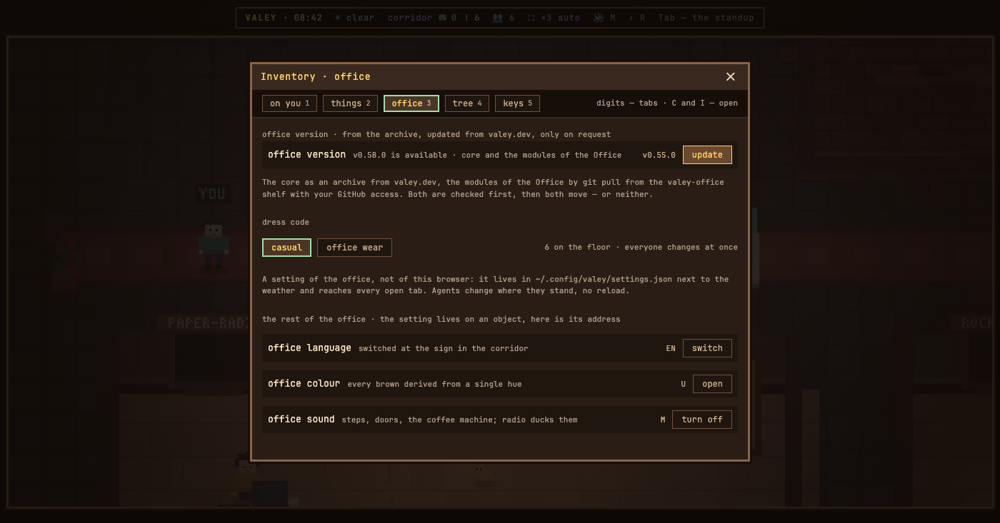

# v0.66.0 — 26 September 2026

## An office installed from an archive updates itself

*office*

The update button knew one office: a checkout, pulled forward with git. An office installed with the one-liner has no git, so pressing «check» answered «update through install.sh» — and install.sh replaces the folder under the running server. The pages come from the new office while the server is still the old one, and it stays that way until a Ctrl-C, which is a restart: the guests, the notes on the desks and the questions agents are holding all go.

Now that office updates itself. «Check» asks valey.dev which version is published and what is in it; «update» downloads the archive together with its checksum, weighs one against the other before anything is unpacked, puts the new office where the old one stood and hands the server over the way the git office already does — no stop, nothing lost. The previous office is left beside it as `<folder>.v<version>`, so undoing an update is moving a folder back, and one copy is kept rather than a growing pile.

For a buyer of the Office there are two halves: the core as an archive, and the modules as a checkout of the `valey-office` shelf. Both are checked first and then both move, or neither — the rule the git office already follows. A shelf that cannot be reached any more is the ordinary end of a subscription rather than a failure: the modules keep working as they are, the core updates alone, and the row says which of the two happened.

The one refusal a checkout cannot have is a checksum that does not match what was published beside the archive. Then the download is deleted, nothing is unpacked, and the office is exactly as it was.

`install.sh` now leaves a note in `~/.config/valey/install.json`, and run with `--update` against a folder whose office is up it asks that office to update itself instead of pulling the floor out from under it.

**Keys**

- `C`, then `3` — the office tab, where the version row is

### What changed

### Added

- **release:** a released office publishes a manifest of its version, so the archive office can ask what is out without downloading it (256d53c)
- **office:** an office installed from an archive updates itself, core from valey.dev and the modules of the Office from the shelf (7f53bbc)
