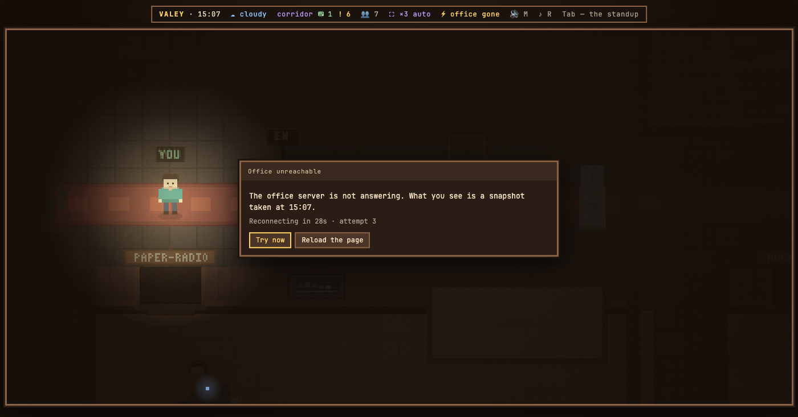

# v0.67.0 — 26 September 2026

## When the office server is gone, the lights go out instead of the floor pretending

*office*

When the server behind an open tab died — a terminal update is enough — the page went on drawing the last snapshot it had. The agents stood there looking idle, every re-read of a transcript answered `Failed to fetch`, and nothing on the screen said the office was gone, so it read as a bug in the agents.

Now the page says so. The first failed reconnect only lights a chip in the header: a blink of the network is not worth a black screen. On the third in a row, about six seconds in, the power goes out — a hum winding down, a relay, and the keyboards fall silent; while it stays out, a UPS somewhere beeps once every fifteen seconds. Everyone on the floor freezes, because everything they are came from the server; their status bubbles go out with the lights, and only a phone glows dimly in each pair of hands. The one who can still move is you, with a flashlight, because you are the only thing on the floor that is not a snapshot.

A plaque in the middle names the moment the picture is from and counts down to the next attempt, with the real timer rather than a spinner. `Try now` skips the wait, `Reload the page` is there for an office that came back with newer page code. An open transcript says that what it shows is the last that got through, instead of quoting the browser's error.

When the stream answers again the lights come back by themselves, with the hum going up and a toast. The page is not reloaded: you stay where you were standing, with whatever panel you had open. A guest sees exactly the same.

### What changed

### Added

- **office:** when the server is gone the lights go out, instead of the floor pretending to be alive (3c16604)

### Other

- chore(office): the power comes back over the same 1.6 s, and the UPS beep is held with a drag (114184e)
- chore(office): a longer power-down, and a quiet UPS beep while the lights are out (8c59fe1)
- chore(stand): the breaker repaints through a hook, so the stand's fake DOM still holds one key listener (79f80e4)
- chore(stand): a breaker on the stand plaque that plays a lost office in this tab (99e3c00)
- chore(office): count a dead server's errors, which the stream never reported as closed (a4f0e0f)
- docs(notes): the picture of the lights going out, rendered from the demo office (ee5d714)
