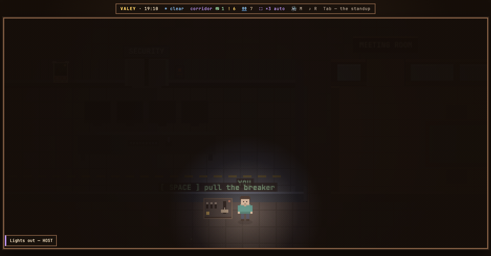

# v0.71.0 — 26 September 2026

## A breaker under the security room puts the whole office in the dark

*office*

An electrical panel is bolted to the outside of the security room, on the wall that faces the corridor below. The room opens only to a card; the panel does not. Walk up to it and press `SPACE`: the hum winds down, a relay clunks, and the office goes dark — for everybody on the floor at once, guests included, and anyone can pull it back up.

It is a joke, not an outage, and it does not pretend otherwise. The agents keep working in the dark: the ones at their desks are lit by their monitors, their bubbles stay on, the keyboards keep clattering, and there is no "office unreachable" plaque. Every person on the floor keeps a flashlight of their own, and a UPS somewhere beeps every fifteen seconds until the lights come back. A toast tells everyone who pulled it.

The light lives in the server's memory only: restarting the office turns it back on, so a breaker left down never leaves an office dark for good.

**Keys**

- `SPACE` at the breaker under the security room — lights out for everyone on the floor, and back on

## In a lost office the phones light the agents holding them, instead of punching holes through the floor

<!-- fix -->

*office*

### What changed

### Added

- **office:** a breaker by the lift puts the whole office in the dark, for everyone (905cdfa)

### Fixed

- **office:** in a lost office the phones light the agents holding them, instead of punching holes through the floor (203aac1)

### Other

- docs(notes): the picture of the breaker's dark, rendered from the demo office (2324a76)
- chore(office): the breaker moves to a panel under the security room, reachable by anyone (a9527b0)
