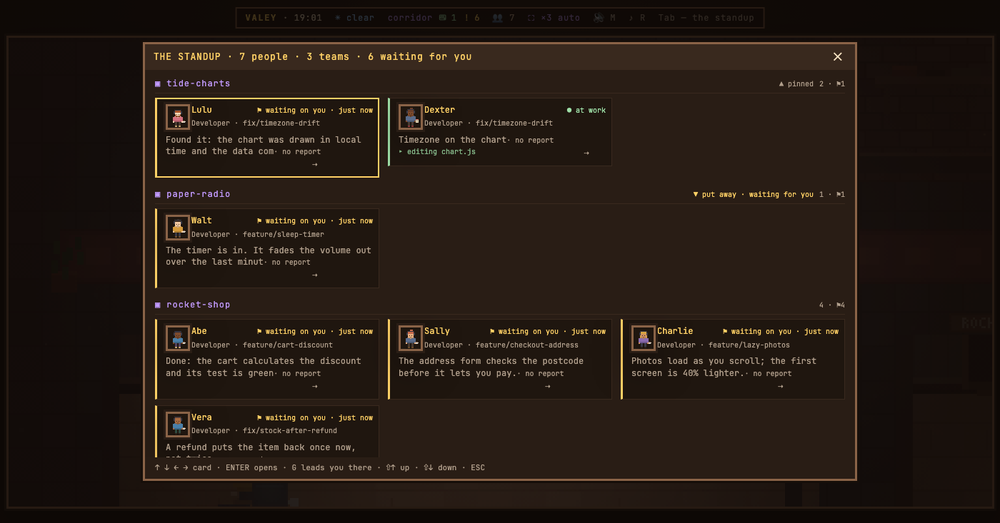

# v0.72.0 — 26 September 2026

## The standup puts first what needs you

*office*

The standup listed the teams in the order their rooms stand on the floor — that is, in the order the sessions happened to be opened — so the project you were working on could be a scroll away, below teams where nobody had moved for an hour.

Now the order is decided when the standup opens: teams where somebody waits for you or stopped come first, then those at work, then those resting, and inside each group the floor order still holds. `Shift+↑` pins a team above everything and `Shift+↓` puts one away as a single line at the bottom; the choice is kept in the office settings. A question beats "put away": a team put away where somebody is waiting rises with the others and says why it is there.

While the standup is open the list does not move: a question that arrives meanwhile marks its team with «new question» and lifts it the next time you open the panel. And the standup no longer lets the floor through — `R` does not start the radio from under it, `B` does not put you on the skateboard, and `0`, `−`, `+` do not zoom the office. Closing, the sound, the shot and `?` still work, and `?` shows exactly that.

**Keys**

- `Shift+↑` — pin the team of the focused card to the top; from put away, bring it back
- `Shift+↓` — put the team away in one line at the bottom; from pinned, unpin it

### What changed

### Added

- **office:** the standup puts first the teams that need you, and Shift+↑↓ pins or puts one away (d0c2e0f)
