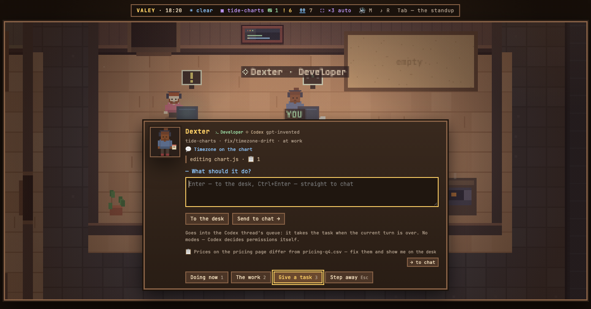

# v0.73.0 — 27 September 2026

## записки на столе переживают перезапуск

*office*

Записка, оставленная на столе, жила только в памяти сервера: Ctrl-C — и её нет. Обновление офиса записки передавало, а перезапуск сметал все столы, включая то, что никто ещё не прочитал, — то есть ровно то, ради чего записку и оставляют. Отправленное в чат при этом не терялось: оно в транскрипте сессии.

Теперь стол хранится на диске, рядом с настройками и по их имени: у стенда со своими настройками свой стол, у офиса на другом порту — свой. Возвращаются последние пять записок на агента, столько же, сколько показывает карточка; чужие и старше месяца не поднимаются. Записка, которую перезапуск застал в пути, больше не висит «отправляется» вечно: офис дочитывает её запуск с диска, как после обновления.

### What changed

### Added

- **office:** notes left on a desk survive a restart, and counted things are said in the right number (f359958)

### Other

- docs(notes): the release note for the desk kept on disk, with a picture of a note lying on one (83a4e2d)
