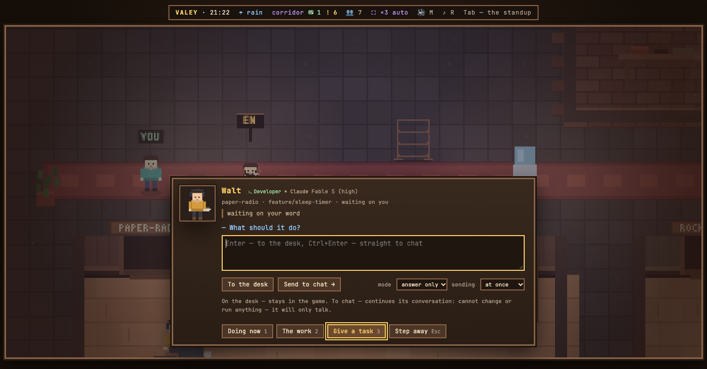

# v0.74.0 — 27 September 2026

## Ctrl+Enter sends a task at once

*office*

Sending a task into an agent's chat took two presses: the first turned the button into «really send?», the second sent it. The first people to try the office found that in the way — Ctrl+Enter is already a deliberate chord, and nobody hits it by accident.

Now it sends with one press, and so do «Send to chat →» and a desk note's «→ to chat». Enter still leaves the note on the desk. Whoever wants the question back picks «ask first» in the new «sending» selector next to the mode, and the hint in the field says which way Ctrl+Enter will go. The choice is kept in the office's settings, one for every tab. A guest never sees it: a guest only leaves notes.

**Keys**

- `Ctrl+Enter` in the task field — straight into the agent's chat, one press

### What changed

### Added

- **office:** Ctrl+Enter sends a task into the chat at once — asking first is a choice in the send row (fbe529b)
