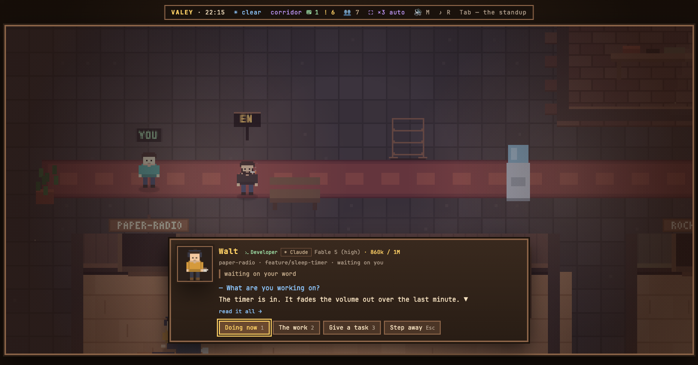
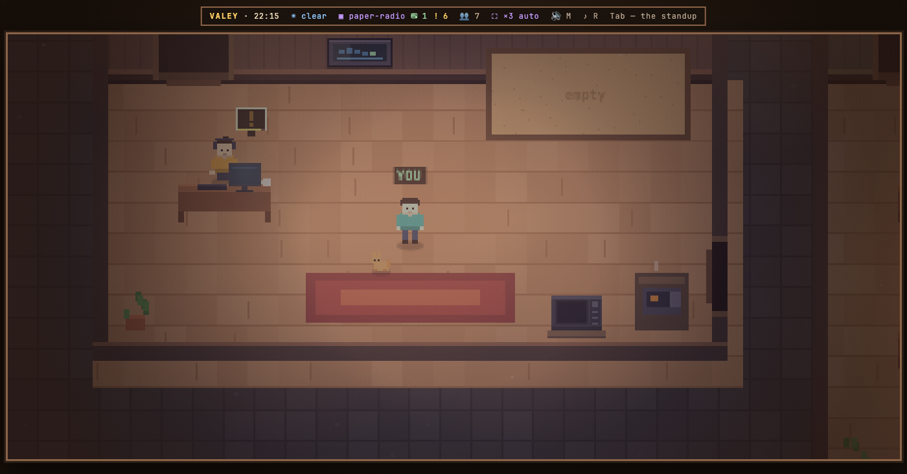

# v0.75.0 — 27 September 2026

## How full an agent's context is, on its card and over its head

*office*

A long session fills its context, and when it is full Claude Code compacts it on its own — mid-task, at whatever the agent was doing. Nothing in the office said how close that was.

Now the model line on an agent's card ends with the context: «Fable 5 (high) · 310k / 1M». Below 80% it is in the model's colour, a number for whoever wants it. From 80% it turns yellow — time to compact, well before the automatic one at about 97% — and the bubble over the agent's head gets a yellow meter along its bottom edge. Below the threshold the floor stays as it was: a strip over every agent would be noise.

The number is read off the session's transcript on this machine: what the last reply was fed, including what came from the cache. After /compact it drops at once, without waiting for the next reply. Claude 5 and newer are counted against 1M, older models against 200k; a model the office does not know shows the bare number, because a percentage of a guessed window would be worse.

## The provider badge on the agent card wears its frame again

<!-- fix -->

*office*

### What changed

### Added

- **office:** how full an agent's context is — on its card's model line, and over its head from 80% (4fa1a5b)

### Fixed

- **office:** the provider badge on the agent card wears its frame again (57275b8)
