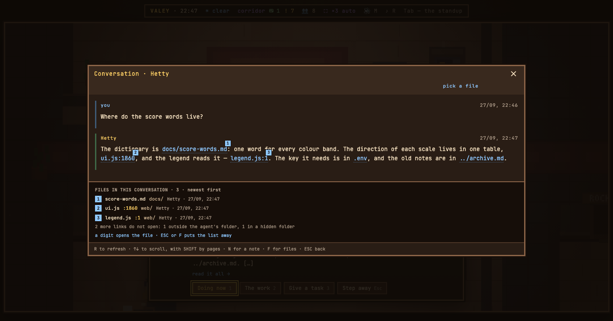

# v0.76.0 — 27 September 2026

## A file an agent names in its reply opens from the conversation — F lists them, a digit opens one on its line

*office*

Claude Code names a file the way its instructions ask — as a link, `[ui.js:1860](web/ui.js:1860)` — and it does so in almost every report. Until now the office drew that link as a dotted line that went nowhere. In a conversation, `F` now raises the files the agent has named: newest first, one per digit, with the line and the folder. The same numbers appear on the links in the text, and a digit opens the file in the office's viewer — on the line the link named, marked with a band, with `ESC` back to the conversation. The mouse opens a link too.

What opens is decided by the office, not the page: a file the agent named in its own reply, inside the agent's folder, and not under a dot folder there — `.env`, `.git`, `.claude`. A link in a prompt does not count. A guest needs the conversation open, as for every other file of an agent. The list says how many links it left out and why — outside the folder, in a hidden folder, or no longer on disk.

### What changed

### Added

- **office:** a file an agent names in its reply opens from the conversation — F lists them, a digit opens one on its line (5c97467)

### Other

- chore(notes): a picture recipe can bring in an agent whose reply names real files (101d238)
