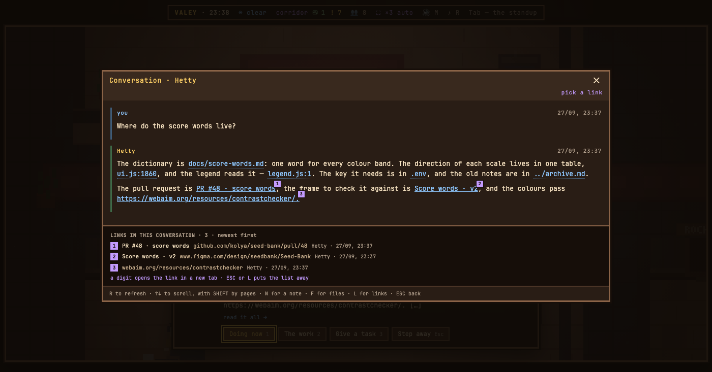

# v0.77.0 — 27 September 2026

## The web links an agent gives in a conversation open from the keyboard — L lists them, a digit opens one

*office*

An agent hands its work over by link — a pull request, a frame in Figma, a release page, a stand — and until now only the mouse could open one; `C` could copy a link, and only one that was on screen. In a conversation, `L` now raises the web links the agent gave in its replies: newest first, one per digit, with the words of the link and its address. The same numbers appear on the links in the text, in lilac beside `F`'s blue and `C`'s green, and a digit opens the link in a new tab while the office stays where it is.

Nothing new reaches the server: the links are already in the conversation the page holds, and a link in a prompt is not listed. `F`, `L` and `C` share the digits, so raising one list puts the others away.

### What changed

### Added

- **office:** the web links an agent gives in a conversation open from the keyboard — L lists them, a digit opens one (8d681fe)

### Other

- chore(notes): the demo agent with real files also gives three web links (0b431f8)
